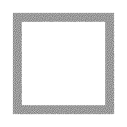
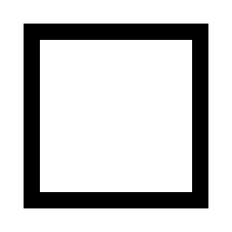

==========================
Image convert
==========================

| See: https://pillow.readthedocs.io/en/stable/reference/Image.html#PIL.Image.Image.convert
| See: https://pillow.readthedocs.io/en/stable/handbook/concepts.html#concept-modes

----
convert
---------

| Use the ``convert(mode=None, matrix=None, dither=None, palette=Palette.WEB, colors=256)`` method to return a converted image.
| mode - The requested mode.
| matrix - An optional conversion matrix. If given, this should be 4- or 12-tuple containing floating point values.
| dither - Dithering method, used when converting from mode “RGB” to “P” or from “RGB” or “L” to “1”. Available methods are Dither.NONE or Dither.FLOYDSTEINBERG (default). Note that this is not used when matrix is supplied.
| palette - Palette to use when converting from mode “RGB” to “P”. Available palettes are Palette.WEB or Palette.ADAPTIVE.
| colors - Number of colors to use for the Palette.ADAPTIVE palette. Defaults to 256.

| To convert to L, the formula used by default is: L = R * 299/1000 + G * 587/1000 + B * 114/1000
| To use a matrix for converting form RGB to L use ``matrix=(.299, .587, .114, 0).

----

Convert to greyscale
----------------------

| Use the **convert(mode='L')** method to convert an image to greyscale.

.. code-block:: python

    from PIL import Image

    with Image.open("shapes/box.png") as im_rgba:
        im_L = im_rgba.convert(mode='L')
        im_L.save("shapes/convert_box_L.png")

    
----

Convert to black and white
----------------------------

| Use the **convert(mode='1')** method to convert an image to black and white, but with poor results. 
| Use the load method can be used with setting the pixel values.
| See: https://pc-pillow.readthedocs.io/en/latest/Image/Image_load.html

.. code-block:: python

    from PIL import Image

    with Image.open("shapes/box.png") as im_rgba:
        im_1 = im_rgba.convert(mode='1')
        im_1.save("image/convert_box_1.png")

| Use the point method to convert greyscale to black and white.

.. code-block:: python

    from PIL import Image

    def func_bw(x):
        return 0 if x < 250 else 255

    with Image.open("shapes/box.png") as im_rgba:
        # convert to greyscale then make black and white using point.
        im_L1 = im_rgba.convert("L").point(func_bw)
        im_L1.save("image/convert_box_L1.png")
        # if mode 1 is required continue to convert to mode 1
        im_1L1 = im_L1.convert(mode='1')
        im_1L1.save("image/convert_box_1L1.png")

    
----

Convert to RGB
----------------------------

| Use the **convert(mode='RGB')** method to convert an image to RGB with transparent regions converted to white (usually).

.. code-block:: python

    from PIL import Image

    with Image.open("shapes/box.png") as im_rgba:
        im_rgb = im_rgba.convert(mode='RGB')
        im_rgb.save("image/convert_box_RGB.png")

| If the above produces black areas instead of white use the following.
| Firstly, create a white png of the same size, then use it as the mask for pasting the original image.

.. code-block:: python

    from PIL import Image

    with Image.open("shapes/box.png") as im:
        im_new = Image.new("RGBA", im.size, "WHITE")
        im_new.paste(im, mask=im)
        im_new.convert("RGB").save("image/box_RGB_white.png")

