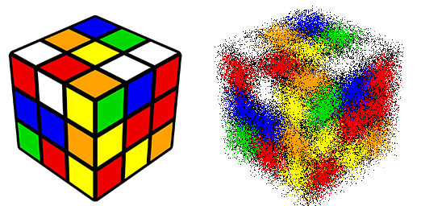

==========================
Image effect_spread
==========================

| See: https://pillow.readthedocs.io/en/stable/reference/Image.html#PIL.Image.effect_spread

----

Effect_spread
----------------------------

| Use ``Image.effect_spread(distance)`` to return an image with randomly spread pixels where distance is the distance to spread pixels.

.. code-block:: python

    from PIL import Image

    with Image.open("test_images/rcube.png") as im:
        new_im = im.effect_spread(24)
        new_im.save("Image/Image_effect_spread.png")

    
