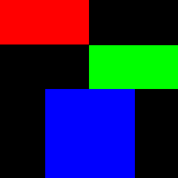

==========================
Image fromarray
==========================

| See: https://pillow.readthedocs.io/en/stable/reference/Image.html#PIL.Image.fromarray
| See: https://pillow.readthedocs.io/en/stable/handbook/concepts.html#concept-modes

| For numpy
| See: https://numpy.org/doc/stable/reference/generated/numpy.full.html#numpy-full
| See: https://numpy.org/doc/stable/reference/generated/numpy.zeros.html#numpy-zeros
| See: https://note.nkmk.me/en/python-numpy-image-processing/

----

Fromarray
----------------------------

| Use ``Image.fromarray(obj, mode=None)`` to return an image from an array of pixels
| obj - Object with array
| mode - Optional mode to use when reading obj. Will be determined from array type if None.

----

Plain Coloured image
----------------------------

| The code below uses a numpy array of size 256x256 to create an image with each pixel of LightSkyBlue, [135, 206, 250].

.. code-block:: python

    from PIL import Image
    import numpy as np

    w, h = 256, 256
    data = np.full(shape=(h, w, 3), fill_value=[135, 206, 250], dtype=np.uint8)
    im = Image.fromarray(data, 'RGB')
    # im.show()
    im.save("Image/Image_fromarray_LightSkyBlue.png")

    

----

Colour regions via numpy
----------------------------

| The code below creates a numpy array of size 256x256 with background in black. 
| 3 coloured patches are added in the numpy array.
| Finally, the image is created from the array.

.. code-block:: python

    from PIL import Image
    import numpy as np

    w, h = 256, 256
    data = np.zeros(shape=(h, w, 3), dtype=np.uint8)
    data[0:64, 0:128] = [255, 0, 0] # red patch
    data[65:128, 128:256] = [0, 255, 0] # green patch
    data[128:256, 65:194] = [0, 0, 255] # blue patch
    im = Image.fromarray(data, 'RGB')
    # im.show()
    im.save("Image/Image_fromarray.png")

    

----

Image into numpy and back
----------------------------

| The image is put in an numpy array, inverted and then given to the fromarray method to make an image.

.. code-block:: python

    from PIL import Image
    import numpy as np

    with Image.open("test_images/crosses.png") as im:
        a = np.array(im)
        # invert using array subtraction
        a = 255 - a
        im2 = Image.fromarray(a)
        # im.show()
        im2.save("Image/Image_fromarray_inv.png")

    
