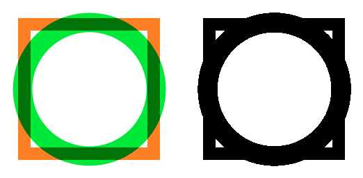

===============================
Image load
===============================

| See: https://pillow.readthedocs.io/en/stable/handbook/tutorial.html#merging-images
| See: https://pillow.readthedocs.io/en/stable/reference/Image.html#PIL.Image.Image.load
| See: https://pillow.readthedocs.io/en/stable/reference/PixelAccess.html#pixelaccess

----

Load for pixel access
---------------------------

| Use the **Image.load** method to load the pixel data.
| In normal cases, the Image class automatically loads an opened image when it is accessed for the first time.
| If the file associated with the image was opened by Pillow, then this method will close it.

.. py:function:: Image.load()

    | Returns an object with pixels indexed by [x, y]
    | Image is the image which will have its pixel data loaded.

| The code below loads the pixel data for an image then converts the data using its pixel values to create a black and white image.

.. code-block:: python

    from PIL import Image

    im_rgba = Image.open("new_images/merged.png") 
    im = im_rgba.convert(mode='RGB')

    im_pixels = im.load()
    # access pixels via [x, y] 
    for col in range(im.size[0]):
        for row in range(im.size[1]):
            if im_pixels[col, row] != (255, 255, 255):
                im_pixels[col, row] = (0, 0, 0)

    im.save("new_images/merged_blackwhite.png")

