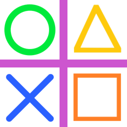
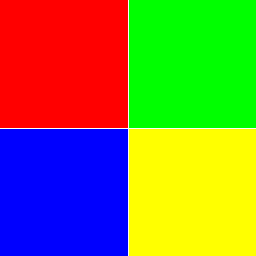
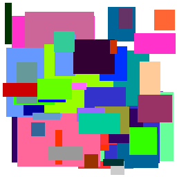
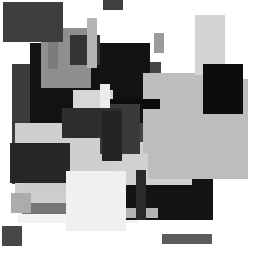
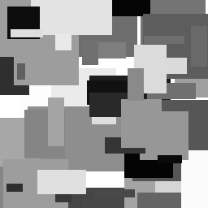
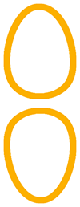
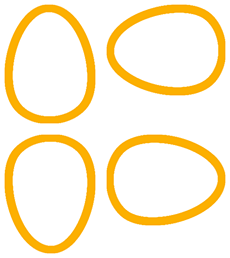
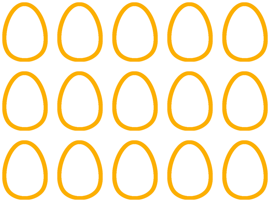
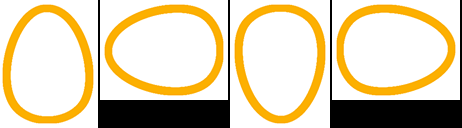
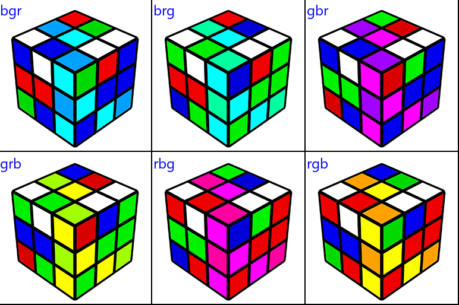

==========================
Image paste
==========================

| See: https://pillow.readthedocs.io/en/stable/reference/Image.html#PIL.Image.Image.paste

| Note: some pasting with images leads to unreliable results with some other operations such pixelaccess on using the laod method.

----

Paste method with images
---------------------------

| Use the paste method to place an image over part of another image
| The code below resizes 4 images to 120 by 120 then pastes them in the 4 corners of an image 256 by 256.

| The simplified paste syntax is: 

.. py:function:: Image.paste(im, box=None)

    | im is the image to paste
    | box can be an optional 4-tuple giving the region to paste into. The size of the pasted image must match the size of the box region.
    | box can be 2-tuple as the upper left corner. 
    | If box is omitted or None, im is pasted into the upper left corner at 0, 0.
    | eg. im1.paste(im2, (0, 0)) pastes image im2 over image im1 in the top left corner.

.. code-block:: python

    from PIL import Image

    s1 = "shapes/o.png"
    s2 = "shapes/x.png"
    s3 = "shapes/tri.png"
    s4 = "shapes/box.png"
    s5 = "shapes/plus.png"
    newsize = (120, 120)

    im1 = Image.open(s1)
    im1s = im1.resize(newsize)
    im2 = Image.open(s2)
    im2s = im2.resize(newsize)
    im3 = Image.open(s3)
    im3s = im3.resize(newsize)
    im4 = Image.open(s4)
    im4s = im4.resize(newsize)

    im5 = Image.open(s5)

    im5.paste(im1s, (0, 0))
    im5.paste(im2s, (0, 256 - 120))
    im5.paste(im3s, (256 - 120 , 0))
    im5.paste(im4s, (256 - 120 , 256 - 120))

    im5.save("Image/Image_shapes_grid.png")

----

Paste method with RGB
---------------------------

.. py:function:: Image.paste(src, box=None)

    | Instead of an image, the source can be a integer or RGB tuple containing pixel colour values. The method then fills the region with the given color.
    | Use the paste method to place RGB colours over part of another image.

| The code below places 4 colour squares in the 4 corners of an image 256 by 256.

.. code-block:: python

    from PIL import Image

    c1 = (255, 0, 0)
    c2 = (0, 255, 0)
    c3 = (0, 0, 255)
    c4 = (255, 255, 0)

    im = Image.new("RGBA", (256, 256))

    im.paste(c1, (0, 0, 128, 128))
    im.paste(c2, (129, 0, 256, 128))
    im.paste(c3, (0, 129, 128, 256))
    im.paste(c4, (129, 129, 256, 256))

    im.save("new_images/colour_squares.png")

----

Paste random coloured rectangles
----------------------------------

| Use the paste method to place random rectangles in an image 256 by 256.
| Create a function, **random_rgb(cvals)**, that takes in a list of numbers in range 0 to 255, and returns random rgb tuples by randomly choosing from the list. Make sure that it doesn't return black (0, 0, 0) or white (255, 255, 255). The lsit used below is the standard websafe list: [0, 51, 102, 153, 204, 255].
| Create a function, **paste_rect(rvals)** that takes a list of lengths in the range 1 to 255, gets a random rgb tuple, calculates a random rectangle and pastes the colour to the base image.
| The random rectangle needs to fit, so once the width and height are chosen, the closet position to the bottom right is calculated so that the random top left positions can be chosen from the top left corner  to the calculated point.
| The code below places between 4 and 30 large rectangels first, then between 4 and 50 small rectangles.

.. code-block:: python

    from PIL import Image
    import random

    def random_rgb(cvals):
        c = (0, 0, 0)
        while c == (0, 0, 0) or c == (255, 255, 255):
            rv = random.choice(cvals)
            gv = random.choice(cvals)
            bv = random.choice(cvals)
            c = (rv, gv, bv)
        return c

    def paste_rect(rvals):
        c = random_rgb(cvals)
        # print(c, end="; ")
        w = random.choice(rvals)
        h = random.choice(rvals)
        x1max = 256 - w
        y1max = 256 - h
        x1 = random.randint(0, x1max)
        y1 = random.randint(0, y1max)
        x2 = x1 + w
        y2 = y1 + h
        im.paste(c, (x1, y1, x2, y2))

    im = Image.new("RGBA", (256, 256), (255, 255, 255))
    cvals = [0, 51, 102, 153, 204, 255]  # standard websafe values

    rvals = [80, 100, 120]
    large_num = random.randint(4, 30)
    for i in range(large_num):
        paste_rect(rvals)

    rvals = [10, 20, 30, 40, 50, 60]
    small_num = random.randint(4, 50)
    for i in range(small_num):
        paste_rect(rvals)

    im.save("new_images/random_colour_rects.png")

----

Paste random greyscale rectangles
----------------------------------

| Use the paste method to place random rectangles in an image 256 by 256.
| Use **Image.new("L", (256, 256), 255)** to make a greyscale image. "L" is the mode for greyscale. The last 255 fills it with white.
| Create a function, **random_rgb(gvals)**, that takes in a list of numbers in range 0 to 255, and returns a random greyscale level value by randomly choosing from the list. The rangle fucntion can be used for a full spectrum of possible values from 0 to 255.
| Create a function, **paste_rect(rvals)** that takes a list of lengths in the range 1 to 255, gets a random greyscale integer, calculates a random rectangle and pastes the greyscal rect angle to the base image.
| The code below places between 4 and 30 large rectangels first, then between 4 and 50 small rectangles.

.. code-block:: python

    from PIL import Image
    import random

    def random_rgb(gvals):
        gv = random.choice(gvals)
        return gv

    def paste_rect(rvals):
        c = random_rgb(gvals)
        # print(c, end="; ")
        w = random.choice(rvals)
        h = random.choice(rvals)
        x1max = 256 - w
        y1max = 256 - h
        x1 = random.randint(0, x1max)
        y1 = random.randint(0, y1max)
        x2 = x1 + w
        y2 = y1 + h
        im.paste(c, (x1, y1, x2, y2))

    im = Image.new("L", (256, 256), 255)
    gvals = range(0,256)
    rvals = [80, 100, 120]
    large_num = random.randint(4, 30)
    for i in range(large_num):
        paste_rect(rvals)

    rvals = [10, 20, 30, 40, 50, 60]
    small_num = random.randint(4, 50)
    for i in range(small_num):
        paste_rect(rvals)

    im.save("new_images/random_grey_rects.png")

----

Paste random greyscale rectangles using offscreen area
--------------------------------------------------------

| Modify **paste_rect(rvals)** to create a new definition, **paste_rect_offscreen(rvals)**, that allows rectangles to be draws partially offscreen, so as to better use the edge areas.
| In, paste_rect_offscreen, the top left position can be offscreen at -100, -100.

.. code-block:: python

    from PIL import Image
    import random

    def random_rgb(gvals):
        gv = random.choice(gvals)
        return gv

    def paste_rect(rvals):
        c = random_rgb(gvals)
        # print(c, end="; ")
        w = random.choice(rvals)
        h = random.choice(rvals)
        x1max = 256 - w
        y1max = 256 - h
        x1 = random.randint(0, x1max)
        y1 = random.randint(0, y1max)
        x2 = x1 + w
        y2 = y1 + h
        im.paste(c, (x1, y1, x2, y2))

    def paste_rect_offscreen(rvals):
        c = random_rgb(gvals)
        # print(c, end="; ")
        w = random.choice(rvals)
        h = random.choice(rvals)
        x1 = random.randint(-100, 245)
        y1 = random.randint(-100, 245)
        x2 = x1 + w
        y2 = y1 + h
        im.paste(c, (x1, y1, x2, y2))

    im = Image.new("L", (256, 256), 255)
    gvals = range(0,256)
    rvals = [80, 100, 120]
    large_num = random.randint(4, 30)
    for i in range(large_num):
        paste_rect_offscreen(rvals)

    rvals = [10, 20, 30, 40, 50, 60]
    small_num = random.randint(4, 50)
    for i in range(small_num):
        paste_rect(rvals)

    im.save("new_images/random_grey_rects_offscreen.png")

----

| Note: some pasting with images leads to unreliable results with some other operations such as pixelaccess on using the load method.

----

2 images side by side
---------------------------

| The code below places 2 images side by side with a white background for areas not covered by the images.
| A gap can be specified between the 2 images.
| Instead of white, a background colour can be specified to fill in the gap and unused space.

.. code-block:: python

    from PIL import Image

    def concat2hor(im1, im2, gap=0, bgcol=(255, 255, 255)):
        w = im1.size[0] + im2.size[0] + gap
        h = max(im1.size[1], im2.size[1])
        im = Image.new("RGBA", (w, h), bgcol)
        im.paste(im1)
        im.paste(im2, (im1.size[0]+ gap , 0))
        return im

    im1 = Image.open("rotations/egg_90.png")
    im2 = Image.open("rotations/egg_270.png")
    im3= concat2hor(im1, im2, 2)
    im3.save("rotations/eggs2h.png")

----

2 images vertically
------------------------

| The code below places 2 images in a column with a white background for areas not covered by the images.
| A gap can be specified between the 2 images.
| Instead of white, a background colour can be specified to fill in the gap and unused space.

.. code-block:: python

    from PIL import Image

    def concat2vert(im1, im2, gap=0, bgcol=(255, 255, 255)):
        w = max(im1.size[0], im2.size[0])
        h = im1.size[1] + im2.size[1] + gap
        im = Image.new("RGBA", (w, h), bgcol)
        im.paste(im1)
        im.paste(im2, (0 , im1.size[1]+ gap ))
        return im

    im1 = Image.open("rotations/egg_0.png")
    im2 = Image.open("rotations/egg_180.png")
    im3= concat2vert(im1, im2, 2)
    im3.save("rotations/eggs2v.png")

----

4 images in a row
---------------------------

| The code below places images from a list into a row with a white background for areas not covered by the images.
| A gap can be specified between the images.
| Instead of white, a background colour can be specified to fill in the gap and unused space.
| Passing None for the bgcol results in a transparent region since it is a PNG in RGBA mode.
| The widths and heights lists are built using list comprehensions.
| The width, w, is found by adding the widths of the images and gaps between them.
| The height, h, is the maximum value from the list of heights.

.. code-block:: python

    from PIL import Image

    def concat_multi_hor(im_list, gap=0, bgcol=(255, 255, 255)):
        widths = [im.width for im in im_list]
        w = sum(widths) + (len(widths) - 1)*gap
        heights = [im.height for im in im_list]
        h = max(heigths)
        im = Image.new("RGBA", (w, h), bgcol)
        for i in range(len(im_list)):
            im.paste(im_list[i], (sum(widths[:i]) + i*gap , 0))
        return im

    im1 = Image.open("rotations/egg_0.png")
    im2 = Image.open("rotations/egg_90.png")
    im3 = Image.open("rotations/egg_180.png")
    im4 = Image.open("rotations/egg_270.png")
    imx = concat_multi_hor([im1, im2, im3, im4], 10 )
    imx.save("rotations/eggs4hor.png")

----

4 images in 2 rows
---------------------------

| The code below first places 2 images together, then another 2, then combines them in column.
| The code below places 4 images in a square with a white background for areas not covered by the images.
| A gap can be specified between the images.
| Instead of white, a background colour can be specified to fill in the gap and unused space.

.. code-block:: python

    from PIL import Image

    def concat2hor(im1, im2, gap=0, bgcol=(255, 255, 255)):
        w = im1.size[0] + im2.size[0] + gap
        h = max(im1.size[1], im2.size[1])
        im = Image.new("RGBA", (w, h), bgcol)
        im.paste(im1)
        im.paste(im2, (im1.size[0]+ gap , 0))
        return im

    def concat2vert(im1, im2, gap=0, bgcol=(255, 255, 255)):
        w = max(im1.size[0], im2.size[0])
        h = im1.size[1] + im2.size[1] + gap
        im = Image.new("RGBA", (w, h), bgcol)
        im.paste(im1)
        im.paste(im2, (0 , im1.size[1]+ gap ))
        return im

    def concat4square(im1, im2, im3, im4, gap=0, bgcol=(255, 255, 255)):
        # layout 1 and 2 in top row, 3 and 4 on bottom row
        imh1= concat2hor(im1, im2, gap, bgcol)
        imh2= concat2hor(im3, im4, gap, bgcol)
        im= concat2vert(imh1, imh2, gap, bgcol)
        return im

    im1 = Image.open("rotations/egg_0.png")
    im2 = Image.open("rotations/egg_90.png")
    im3 = Image.open("rotations/egg_180.png")
    im4 = Image.open("rotations/egg_270.png")
    im5= concat4square(im1, im2, im3, im4, 2)
    im5.save("rotations/eggs4.png")

----

Tiling an image
--------------------

| The defition, ``tile_image(im, xnum, ynum, gap=0, bgcol=(255, 255, 255))``, is used to make a 5 by 3 tiling of the image below. 

.. code-block:: python

    from PIL import Image

    def tile_image(im, xnum, ynum, gap=0, bgcol=(255, 255, 255)):
        w, h = im.size
        wt = w*xnum + (xnum - 1)*gap
        ht = h*ynum + (ynum - 1)*gap
        imx = Image.new("RGBA", (wt, ht), bgcol)
        for iy in range(ynum):
            for ix in range(xnum):
                imx.paste(im, (w*ix + gap*ix, h*iy + gap*iy))
        return imx

    im1 = Image.open("rotations/egg_0.png")
    imx = tile_image(im1, 5, 3, 10)
    imx.save("rotations/eggs_tile.png")

----

Image paths to list for row
---------------------------

| ``[Image.open(str(win_im_path)) for win_im_path in im_paths]`` takes a list of image paths and returns a list of images to be used by ``concat_multi_hor``.

.. code-block:: python

    from PIL import Image

    def concat_multi_hor(im_list, gap=0, bgcol=(255, 255, 255)):
        widths = [im.width for im in im_list]
        w = sum(widths) + (len(widths) - 1)*gap
        heights = [im.height for im in im_list]
        h = max(heights)
        im = Image.new("RGBA", (w, h), bgcol)
        for i in range(len(im_list)):
            im.paste(im_list[i], (sum(widths[:i]) + i*gap , 0))
        return im

    im_paths = [
                "rotations/egg_0.png",
                "rotations/egg_90.png",
                "rotations/egg_180.png",
                "rotations/egg_270.png"
                ]

    im_list = [Image.open(str(win_im_path)) for win_im_path in im_paths]
    imx = concat_multi_hor(im_list, gap=2, bgcol=(0, 0, 0))
    imx.save("Image/paths_row.png")

----

Image folder to 2d layout
-------------------------------------

| THe code below gets the files in a folder and arranges them in a 2d layout.

.. code-block:: python

    from PIL import Image
    from pathlib import Path

    def concat_multi_hor(im_list, gap=0, bgcol=(255, 255, 255)):
        widths = [im.width for im in im_list]
        w = sum(widths) + (len(widths) - 1)*gap
        heights = [im.height for im in im_list]
        h = max(heights)
        im = Image.new("RGBA", (w, h), bgcol)
        for i in range(len(im_list)):
            im.paste(im_list[i], (sum(widths[:i]) + i*gap , 0))
        return im

    def concat_multi_vert(im_list, gap=0, bgcol=(255, 255, 255)):
        heights = [im.height for im in im_list]
        h = sum(heights) + (len(heights) - 1)*gap
        widths = [im.width for im in im_list]
        w = max(widths)
        im = Image.new("RGBA", (w, h), bgcol)
        for i in range(len(im_list)):
            im.paste(im_list[i], (0, sum(heights[:i]) + i*gap))
        return im

    def concat_multi_2d(im_list_2d, gap=0, bgcol=(255, 255, 255)):
        im_list_v = [concat_multi_hor(im_list_h, gap, bgcol) for im_list_h in im_list_2d]
        return concat_multi_vert(im_list_v, gap, bgcol)

    im_dir = "Image/image_merge2/"
    cwd = Path.cwd()
    im_fp = cwd / im_dir
    im_files = [f for f in im_fp.iterdir() if f.suffix == '.png'] 
    im_files_rel = [sfile.relative_to(cwd) for sfile in im_files]
    ims = [Image.open(win_im_path) for win_im_path in im_files_rel]
    # make list of files in 2d list with n per row
    n = 3
    list_2d = [ims[i:i+n] for i in range(0, len(ims), n)]
    # make 2d image
    im_new = concat_multi_2d(list_2d)
    im_new.save("Image/Image_2d_folder.png")

