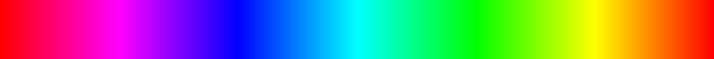
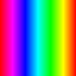
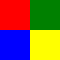

==========================
Image putdata
==========================

| See: https://pillow.readthedocs.io/en/stable/reference/Image.html#PIL.Image.Image.putdata
| See: https://pillow.readthedocs.io/en/stable/reference/ImageColor.html#PIL.ImageColor.getrgb

----

Putdata
---------------------------

| Use the ``Image.putdata(data, scale=1.0, offset=0.0)`` method to copy pixel data from a flattened sequence object into an image. The values should start at the upper left corner (0, 0), continue to the end of the line, followed directly by the first value of the second line, and so on. Data will be read until either the image or the sequence ends. The scale and offset values are used to adjust the sequence values: pixel = value*scale + offset.
| data - A flattened sequence object.
| scale - An optional scale value. The default is 1.0.
| offset - An optional offset value. The default is 0.0.

| The simplified putdata syntax is: 

.. py:function:: Image.putdata(rgb_pixel_data)

    | rgb_pixel_data is a list of rgb tuples.
    | The number of tuples will be equal to the width * height of the image.

----

Spectrum
---------------------------

| The code below produces a spectrum numerically.
| The code builds a row of colours.
| The code starts with red (255, 0, 0) and increases blue to form magenta (255, 0, 255).
| Next the red deceases down to blue (0, 0, 255).
| Next the green increases to cyan (0, 255, 255).
| Next the blue decreases down to green (0, 255, 0)
| Next the red increases to yellow (255, 255, 0).
| Next the green decreases down to red (255, 0, 0)
| Then the row is replicated using list multiplication.
| ``data = color_row * height`` produces a list made up of the first row of rgb tuples repeated for the given height.
| A blank image is then created: ``im = Image.new("RGB", (width1, height))``.
| And the image data is put into the image. ``im.putdata(data)``
| The image is then saved, resized and saved again.

.. code-block:: python

    from PIL import Image, ImageColor

    def color_spectrum(height):
        red = 255
        green = 0
        blue = 0
        color_row = []
        for j in range (0, 255*6+1):
            if j > 0 and j <= 255:
                blue += 1
            elif j > 255 and j <= 255*2:
                red -= 1
            elif j > 255*2 and j <= 255*3:
                green += 1
            elif j > 255*3 and j <= 255*4:
                blue -= 1
            elif j > 255*4 and j <= 255*5:
                red += 1
            elif j > 255*5 and j <= 255*6:
                green -= 1
            color_row.append((red, green, blue))
        width1 = j + 1  # add 1 for the initial 0
        data = color_row * height
        im = Image.new("RGB", (width1, height))
        im.putdata(data)
        return im

    im = color_spectrum(128) 
    im.save("new_images/putdata_spectrum.png")
    im2 = im.resize((128,128))
    im2.save("new_images/putdata_spectrum_128.png")

| The full width spectrum:

|  
| The spectrum resized to 128, 128:

----

4 square
---------------------------

| The code below produces a 100 by 100 pixel square with 4 colours squares.
| List comprehension is used to build a repeated sequence of pixel rgb valwes.
| The function passes in a list of colours. If the colours are not rgb tuples, they need to be converted first by ImageColor.getrgb(color).
| See: https://pillow.readthedocs.io/en/stable/reference/ImageColor.html#PIL.ImageColor.getrgb

| The getrgb syntax is: 

.. py:function:: ImageColor.getrgb(color)

    | color is a color which may include standard html color names strings and hex colour strings.
    | e.g. ["red", "green", "blue", "yellow"] is converted to [(255, 0, 0), (0, 128, 0), (0, 0, 255), (255, 255, 0)]
    | e.g. ["#ffccff", "#ccffff"] is converted to [(255, 204, 255), (204, 255, 255)]

| ``four_colour_square(colors)`` takes a list of colours as the argument and returns an image.
| This line converts the colour list to rgd values using list comprehension:
``colors_rgb = [ImageColor.getrgb(color) for color in colors]``.
| Each colour is set to pixel wide and 50 pixels high.
| A row of 50 pixels of one colour and 50 pixels of another colour is built. Then this is repeated for 50 rows.
| ``[colors_rgb[0] for _ in range(col_width)]`` creates the first 50 pixels since col_width is 50. The underscore vaiable is a throwaway variable for the for loop with the range function since it is not used elsewhere in the lsit comprehension.
| ``[colors_rgb[1] for _ in range(col_width)]`` makes the second 50 pixels in the first row.
| ``* col_height`` repeats the first row 50 times.
| A similar appraoch is used for the lower 2 colours.
| The top 50 rows are joined to the bottom 50 via: ``data1 + data2``.

.. code-block:: python

    from PIL import Image, ImageColor

    def four_colour_square(colors):
        col_width = 50
        col_height = 50
        width = col_width * 2
        height = col_height * 2
        colors_rgb = [ImageColor.getrgb(color) for color in colors]
        data1 = ([colors_rgb[0] for _ in range(col_width)] + [colors_rgb[1] for _ in range(col_width)]) * col_height
        data2 = ([colors_rgb[2] for _ in range(col_width)] + [colors_rgb[3] for _ in range(col_width)]) * col_height
        data = data1 + data2
        im = Image.new("RGB", (width, height))
        im.putdata(data)
        return im

    im = four_colour_square(["red", "green", "blue", "yellow"])
    im.save("new_images/putdata_square.png")

----

Colour Palette
---------------------------

| The code below produces a colour palette typically seen on websites on colour.
| ``color_palette(colors, color_width=20, height=100)`` takes a list of colours as the argument and 2 optional arguments, then returns an image. The default width of each colour is 20. The default image height is 100.
| ``for c in colors_rgb`` iterates through the list of colours.
| ``[c] * color_width`` creates a list of the colour 20 times (color_width).
| ``data.extend([c] * color_width)`` add the multiple copies of the same colour tuple to thte list.
| ``data *= height`` replicates the first row of all the colours so it fills down for the full height.

.. code-block:: python

    from PIL import Image, ImageColor

    def color_palette(colors, color_width=20, height=100):
        height = height
        color_width = color_width
        colors_rgb = [ImageColor.getrgb(color) for color in colors]
        width = len(colors_rgb) * color_width
        data = []
        for c in colors_rgb:
            data.extend([c] * color_width)
        data *= height  
        im = Image.new("RGB", (width, height))
        im.putdata(data)
        return im

    colors = ["#ffccff", "#ccffff", "#99ffcc", "#cc99ff", "#ffcc99"]
    im = color_palette(colors, 20, 100)   
    im.save("new_images/putdata_palette5.png") 

.. image:: images/Image_putdata_palette5.png
    :scale: 100%
    :align: center

