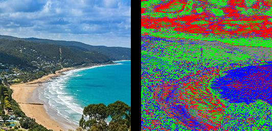

==========================
Image putpalette
==========================

| See: https://pillow.readthedocs.io/en/stable/reference/Image.html#PIL.Image.Image.putpalette

----

Putpalette 
----------------------------

| Use the ``Image.putpalette(data, rawmode='RGB')`` to attach a palette to an image. 
| The image must be a "P", "PA", "L" or "LA" image. L is greyscale. P has a palette.
| data - A palette sequence (either a list or a string).
| rawmode - The raw mode of the palette. Either "RGB", "RGBA", or a mode that can be transformed to "RGB" or "RGBA" (e.g. "R", "BGR;15", "RGBA;L").

| The palette sequence must contain at most 256 colors, made up of one integer value for each channel in the raw mode. For example, if the raw mode is "RGB", then it can contain at most 768 values, made up of red, green and blue values for the corresponding pixel index in the 256 colors. 
| If the raw mode is "RGBA", then it can contain at most 1024 values, containing red, green, blue and alpha values.
| Alternatively, an 8-bit string may be used instead of an integer sequence.

----

Putpalette list
----------------------------

| The code below uses a list of a sequence of colours as the palette.

.. code-block:: python

    from PIL import Image

    palstarter = [
        0, 0, 255,
        0, 255, 0,
        255, 0, 0,
        128, 128, 128,
    ]
    # use 256 palette
    pal = palstarter * 64

    with Image.open("test_images/lorne.jpg") as im:
        im_P = im.convert(mode="P", palette=Image.Palette.WEB, colors=4)
        im_P.putpalette(pal, rawmode='RGB')
        im_P.save("Image/Image_putpalette_list.png")

----

.. code-block:: python

    from PIL import Image

    with Image.open("test_images/hut.jpg") as im:
        im_P = im.convert(mode="P", palette=Image.Palette.ADAPTIVE, colors=16)
        im_P.save("Image/Image_putpalette_a.png")
        pal = im_P.getpalette()
        
    with Image.open("test_images/lorne.jpg") as im:
        im_P = im.convert(mode="P", palette=Image.Palette.ADAPTIVE, colors=16)
        im_P.save("Image/Image_putpalette_b.png")

        im_P.putpalette(pal)
        im_P.save("Image/Image_putpalette_ab.png")

.. image:: images/compare_putpalette_list2.png
    :scale: 50%
    :align: center

