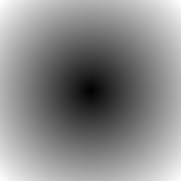

==========================
Image radial_gradient
==========================

| See: https://pillow.readthedocs.io/en/stable/reference/Image.html#PIL.Image.radial_gradient

----

radial_gradient
----------------------------

| Use ``Image.radial_gradient(mode)`` to generate 256x256 radial gradient from black to white, centre to edge.
| Input mode is from ["L", "P"].

.. code-block:: python

    from PIL import Image

    im = Image.radial_gradient('L')
    im.save("test_images/Image_radial_gradient.png")

    
