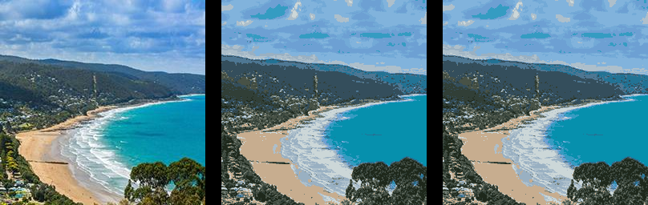

==========================
Image remap_palette
==========================

| See: https://pillow.readthedocs.io/en/stable/reference/Image.html#PIL.Image.Image.remap_palette
| See: https://hhsprings.bitbucket.io/docs/programming/examples/python/PIL/Image__class_Image.html#putpalette-remap-palette

----

Remap_palette 
----------------------------

| Use the ``Image.remap_palette(dest_map, source_palette=None)`` method to return an image that has been rewritten to reorder the palette.
| dest_map - A list of indexes into the original palette. e.g. [1,0] would swap a two item palette,
and list(range(256)) is the identity transform.
| source_palette - Bytes or None.
| remap_palette will change both pixel value and palette (in other words, indexes as pixel values will follow new palette table)

----

Remap_palette 
----------------------------

| The code below converts the image to P, palette mode, gets its colours, reorders them and remaps the palette.
| The image before and after remapping should appear the same.

.. code-block:: python

    from PIL import Image

    def sort_by_neg_zeroth(elem):
        return -elem[0]

    with Image.open("test_images/lorne.jpg") as im:
        im_P = im.convert("P", palette=Image.Palette.ADAPTIVE, colors=16)
        im_P.save('Image/Image_remap_palette_before.png')

        clrs = im_P.getcolors()
        clrs.sort(key=sort_by_neg_zeroth)  # sort by occurrence
        # [(7776, 4), (7474, 10), (7021, 13), (6466, 6), (5337, 2), (4308, 14), (3991, 12), (3607, 1), (3493, 15), (3179, 5), (2868, 0), (2644, 8), (2527, 3), (1857, 7), (1683, 9), (1305, 11)]
        clr_order_for_remap = [c for oc, c in clrs]
        # [4, 10, 13, 6, 2, 14, 12, 1, 15, 5, 0, 8, 3, 7, 9, 11]
        im_P = im_P.remap_palette(clr_order_for_remap)
        im_P.save('Image/Image_remap_palette_after.png')

