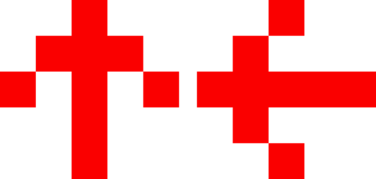
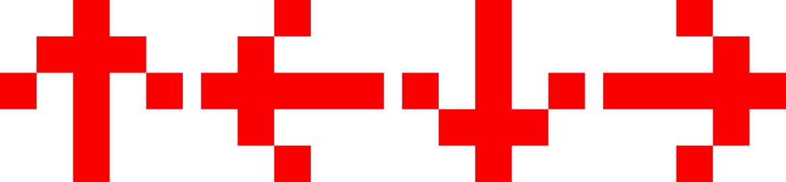
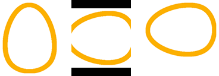

==========================
Image rotate
==========================

| See: https://pillow.readthedocs.io/en/stable/reference/Image.html#PIL.Image.Image.rotate

----

| Use the ``Image.rotate(angle, resample=Resampling.NEAREST, expand=0, center=None, translate=None, fillcolor=None)`` method to return a rotated copy of the image, rotated the given number of degrees counter clockwise around its centre.
| angle - In degrees counter clockwise.
| resample - An optional resampling filter. This can be one of Resampling.NEAREST (use nearest neighbour), Resampling.BILINEAR (linear interpolation in a 2x2 environment), or Resampling.BICUBIC (cubic spline interpolation in a 4x4 environment). If omitted, or if the image has mode "1" or "P", it is set to Resampling.NEAREST.
| expand - Optional expansion flag. If true, expands the output image to make it large enough to hold the entire rotated image. If false or omitted, make the output image the same size as the input image. Note that the expand flag assumes rotation around the center and no translation.
| center - Optional center of rotation (a 2-tuple). Origin is the upper left corner. Default is the center of the image.
| translate - An optional post-rotate translation (a 2-tuple).
| fillcolor - An optional color for area outside the rotated image.

----

Rotate to 90
----------------------------

| The code below rotates an image 90 degrees counterclockwise and saves it with another name.

.. code-block:: python

    from PIL import Image

    with Image.open("arrows/arrow_0.png") as im:
        im2 = im.rotate(90)
        im2.save("arrows/arrow_90.png")

    
----

Rotate to 90, 180, 270
----------------------------

| The code below rotates an image 90, 180 and 270 degrees and saves them.

.. code-block:: python

    from PIL import Image

    with Image.open("arrows/arrow_0.png") as im:
        angles = [90, 180, 270]
        for ang in angles:
            im2 = im.rotate(ang)
            im2.save("arrows/arrow_" + str(ang) +".png")

    
----

Rotate to 45, 135, 225, 315
----------------------------

| The code below rotates an image 45, 135, 225, 315 degrees and saves them.

.. code-block:: python

    from PIL import Image
    
    with Image.open("arrows/arrow_0.png") as im:
        angles = [45, 135, 225, 315]
        for ang in angles:
            im2 = im.rotate(ang)
            im2.save("arrows/arrow_" + str(ang) +".png")

----

Rotate and expand
----------------------------

| The code below rotates an image 90, firstly without expanding to fit, then expanding to fit.

.. code-block:: python

    from PIL import Image

    with Image.open("rotations/egg.png") as im:
        im1 = im.rotate(90, expand=0)
        im1.save("rotations/egg_90.png")
        im2 = im.rotate(90, expand=1)
        im2.save("rotations/egg_90_expand.png")

