==========================
Image transform
==========================

| See: https://pillow.readthedocs.io/en/stable/reference/Image.html#PIL.Image.Image.transform
| See: https://github.com/python-pillow/Pillow/blob/main/src/PIL/ImageTransform.py
| See: https://pillow.readthedocs.io/en/stable/_modules/PIL/Image.html#Transform
| See: https://pygis.io/docs/d_affine.html
| See: https://stackabuse.com/affine-image-transformations-in-python-with-numpy-pillow-and-opencv/
| See: https://stackoverflow.com/questions/53032270/perspective-transform-with-python-pil-using-src-target-coordinates

----

Transform
----------------------------

| Use the ``Image.transform(size, method, data=None, resample=Resampling.NEAREST, fill=1, fillcolor=None)`` method returns a transformed image.
| This method creates a new image with the same mode as the original.

.. py:function:: Image.transform(size, method, data=None, resample=Resampling.NEAREST, fill=1, fillcolor=None)

    | size - The output size.

    | method - The transformation method. This is one of:
    |   Image.Transform.EXTENT (cut out a rectangular subregion), 
    |   Image.Transform.QUAD (map a quadrilateral to a rectangle), 
    |   Image.Transform.AFFINE (affine transform), 
    |   Image.Transform.PERSPECTIVE (perspective transform), 
    |   Image.Transform.MESH (map a number of source quadrilaterals in one operation).

    | data - the parametrs for the method.

    | resample - Optional resampling filter. It can be one of:
    |   Resampling.NEAREST (use nearest neighbour) [if the image has mode "1" or "P"], 
    |   Resampling.BILINEAR (linear interpolation in a 2x2 environment), 
    |   Resampling.BICUBIC (cubic spline interpolation in a 4x4 environment). 

    | fill - It is unused, unless a class object is used for the method (see docs).
    | fillcolor - Optional fill color for the area outside the transform in the output image.

Method and Data:
----------------------

| Image.Transform.EXTENT (cut out a rectangular subregion)
| A 4-tuple (x0, y0, x1, y1) also known as a bounding box.
| Maps a rectangle (defined by two corners) from the image to a rectangle of the given size. 
| The resulting image will contain data sampled from between the corners, such that (x0, y0) in the input image will end up at (0,0) in the output image, and (x1, y1) at size.
| This method can be used to crop, stretch, shrink, or mirror a rectangle in the current image.

| Image.Transform.QUAD (map a quadrilateral to a rectangle), 
| An 8-tuple (x0, y0, x1, y1, x2, y2, x3, y3) which contain the upper left, lower left, lower right, and upper right corner of the source quadrilateral, moving anticlockwise.

| Image.Transform.AFFINE (affine transform), 
| A 6-tuple (a, b, c, d, e, f)  which contain the first two rows from an affine transform matrix. 
| For each pixel (x, y) in the output image, the new value is taken 
| from a position (a*x + b*y + c, d*x + e*y + f) in the input image, rounded to the nearest pixel.
| This function can be used to scale, translate, rotate, and shear the original image.
| Translate xt, yt with [1, 0, xt, 0, 1, yt]  e.g. [1, 0, -64, 0, 1, -32]
| Mirror with [-1, 0, im.width, 0, 1, 0]  e.g. [-1, 0, 256, 0, 1, 0]
| Dilate dx, dy with [dx, 0, 0, 0, dy, 0]  e.g. [0.5, 0, 0, 0, 0.75, 0]
| Shear rx, ry with [1, rx, 0, ry, 1, 0]  e.g [1, 0.01, 0, -0.05, 1, 0]
| Rotate θ with [cosθ, -sinθ, 0, sinθ, cosθ, 0]  e.g. [0.98, -0.17, 0, 0.17, 0.98, 0]

| Image.Transform.PERSPECTIVE (perspective transform), 
| The 8 transform coefficients (a, b, c, d, e, f, g, h) correspond to the following transformation:
| x' = (ax + by + c) / (gx + hy + 1)
| y' = (dx + ey + f) / (gx + hy + 1)
| These 8 coefficients can in general be found from solving 8 linear equations that define how 4 points on the plane transform.

| Image.Transform.MESH (map a number of source quadrilaterals in one operation).
| A list of (bounding box, quad) tuples.
| [((0, 0, w//2, h//2), (0, 0, 0, h, w, h, w, 0)), ((w//2, h//2, w, h), (0, 0, 0, h, w, h, w, 0))]

----

Transform.EXTENT crop
--------------------------

.. code-block:: python

    from PIL import Image

    def box_cropped_edges(im, left, top, right, bottom):
        w, h = im.size
        return (w - left - right, h - top - bottom), (left, top, w - right, h - bottom)

    with Image.open("test_images/shapes.png") as im:
        # crop     
        new_size, box = box_cropped_edges(im, 8, 8, 8, 8)
        im_new = im.transform(new_size, Image.Transform.EXTENT, data=box)
        im_new.save("image/transform_extent_box_cropped_edges.png")

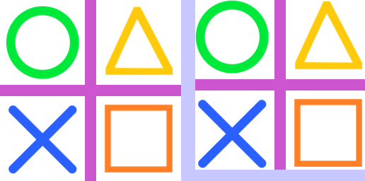
    
----

Transform.EXTENT expand
-------------------------

.. code-block:: python

    from PIL import Image

    def box_cropped_edges(im, left, top, right, bottom):
        w, h = im.size
        return (w - left - right, h - top - bottom), (left, top, w - right, h - bottom)

    with Image.open("test_images/shapes.png") as im:
        # expand crop with <0 values
        new_size, box = box_cropped_edges(im, -8, -8, -8, -8)
        im_new = im.transform(new_size, Image.Transform.EXTENT, data=box)
        im_new.save("image/transform_extent_box_expand.png")

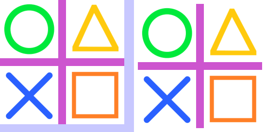
    
----

Transform.QUAD
---------------------

.. code-block:: python

    from PIL import Image

    with Image.open("test_images/shapes.png") as im:
        quad = [0, 0, 0, 256, 256, 512, 256, -256]
        im_new = im.transform((256, 256), Image.Transform.QUAD, data=quad)
        im_new.save("image/transform_quad.png")

.. image:: images/compare_transform_quad.png
    :scale: 50%
    :align: center
    

----

Transform.AFFINE translate
------------------------------

.. code-block:: python

    from PIL import Image

    def affine_translate(right=0, down=0):
        return (1, 0, -right, 0, 1, -down)
        
    with Image.open("test_images/shapes.png") as im:
        affine = affine_translate(right=16, down=32)
        im_new = im.transform(im.size, Image.Transform.AFFINE, data=affine)
        im_new.save("image/transform_affine_translate.png")

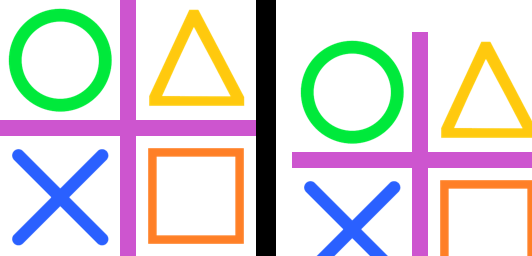

----

Transform.AFFINE mirror
------------------------------

.. code-block:: python

    from PIL import Image

    def affine_mirror(im, hor=True, vert=False):
        if hor == True and vert == True:
            return (-1, 0, im.width, 0, -1, im.height)
        elif hor == True:
            return (-1, 0, im.width, 0, 1, 0)
        elif vert == True:
            return (1, 0, 0, 0, -1, im.height)
        else:
            return (1, 0, 0, 0, 1, 0)

    with Image.open("test_images/shapes.png") as im:

        affine = affine_mirror(im, hor=True, vert=False)
        im_new = im.transform(im.size, Image.Transform.AFFINE, data=affine)
        im_new.save("image/transform_affine_mirrorhor.png")

        affine = affine_mirror(im, hor=False, vert=True)
        im_new = im.transform(im.size, Image.Transform.AFFINE, data=affine)
        im_new.save("image/transform_affine_mirrorvert.png")

        affine = affine_mirror(im, hor=True, vert=True)
        im_new = im.transform(im.size, Image.Transform.AFFINE, data=affine)
        im_new.save("image/transform_affine_mirrorverthor.png")

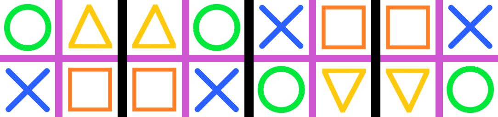
    

----

Transform.AFFINE dilate
------------------------------

.. code-block:: python

    from PIL import Image

    def affine_dilate(xfactor=1, yfactor=1):
        return (1 / xfactor, 0, 0, 0, 1 / yfactor, 0)

    with Image.open("test_images/shapes.png") as im:
        affine = affine_dilate(xfactor=2, yfactor=1)
        im_new = im.transform(im.size, Image.Transform.AFFINE, data=affine)
        im_new.save("image/transform_affine_dilate.png")

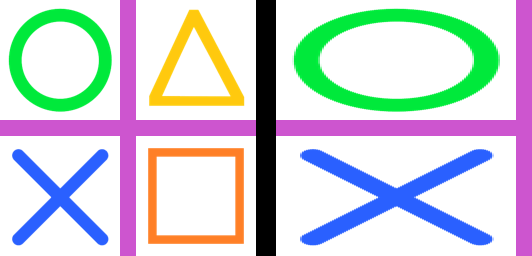
    

----

Transform.AFFINE shear
------------------------------

.. code-block:: python

    from PIL import Image

    def affine_shear(xpercent=1, ypercent=1):
        return (1, xpercent / 100, 0, ypercent / 100, 1, 0)

    with Image.open("test_images/shapes.png") as im:
        affine = affine_shear(xpercent=1, ypercent=-5)
        im_new = im.transform(im.size, Image.Transform.AFFINE, data=affine)
        im_new.save("image/transform_affine_shear.png")

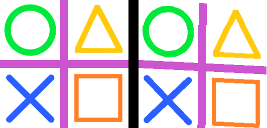
    
----

Transform.AFFINE tilt_hor
---------------------------

.. code-block:: python

    from PIL import Image

    def affine_tilt_hor(im, theta):
        st = round(math.tan(math.radians(theta)), 3)
        w = im.width
        xshift = abs(st) * w
        new_w = w + int(xshift)
        affine = (1, st, -xshift if st > 0 else 0, 0, 1, 0)
        # print("affine_tilt_hor ", affine)
        return new_w, affine

    with Image.open("test_images/shapes.png") as im:
        new_w, affine = affine_tilt_hor(im, theta=-20)
        im_new = im.transform((new_w, im.height), Image.Transform.AFFINE, data=affine)
        im_new.save("image/transform_affine_tilt_hor.png")

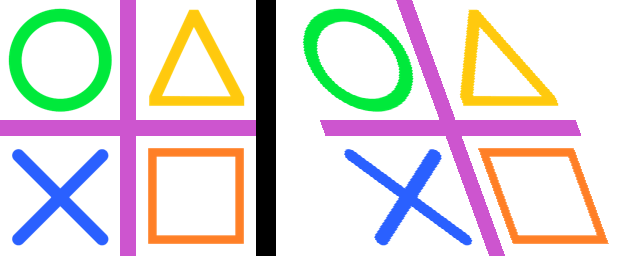

----

Transform.AFFINE tilt_vert
---------------------------

.. code-block:: python

    from PIL import Image

    def affine_tilt_vert(im, theta):
        ct = round(math.tan(math.radians(theta)), 3)
        h = im.height
        yshift = abs(ct) * h
        new_h = h + int(yshift)
        affine = (1, 0, 0, ct, 1, -yshift if ct > 0 else 0)
        # print("affine_tilt_vert ", affine)
        return new_h, affine
    

    with Image.open("test_images/shapes.png") as im:
        new_h, affine = affine_tilt_vert(im, theta=-20)
        im_new = im.transform((im.width, new_h), Image.Transform.AFFINE, data=affine)
        im_new.save("image/transform_affine_tilt_vert.png")

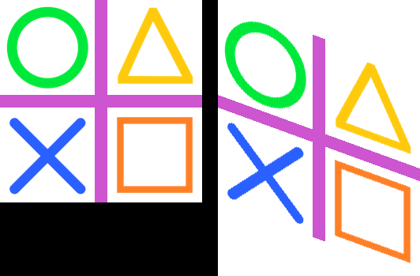

----

Transform.AFFINE rotate
------------------------

.. code-block:: python

    from PIL import Image

    def affine_rotation_coeffs(theta, x, y):
        # affine formula to rotate theta about a point x, y
        ct = math.cos(math.radians(theta))
        st = math.sin(math.radians(theta))
        return (ct, -st, x*(1-ct) + y*st, st, ct, y*(1-ct)-x*st)

    with Image.open("test_images/shapes.png") as im:
        affine = affine_rotation_coeffs(theta=-10, x=128, y=128)
        im_new = im.transform((256, 256), Image.Transform.AFFINE, data=affine)
        im_new.save("image/transform_affine_rotate.png")

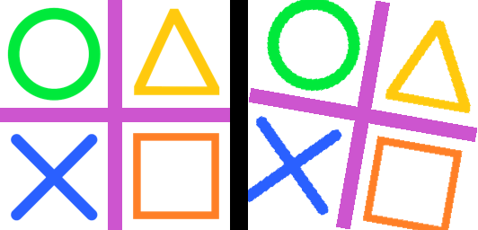

----

Transform.PERSPECTIVE
------------------------

.. code-block:: python

    from PIL import Image
    import math

    def affine_rotation_coeffs(theta, x, y):
        # affine formula to rotate theta about a point x, y
        ct = math.cos(math.radians(theta))
        st = math.sin(math.radians(theta))
        return (ct, -st, x*(1-ct) + y*st, st, ct, y*(1-ct)-x*st)

    with Image.open("test_images/shapes.png") as im:
        perspective = (1, 0, 0, 0, 1, 0, -0.001, 0.001)
        im_new = im.transform((256, 256), Image.Transform.PERSPECTIVE, data=perspective)
        im_new.save("image/transform_perspective1.png")

        perspective = (1, -0.364, 0, 0, 1, 0, -0.008, 0.001)
        im_new = im.transform((256, 256), Image.Transform.PERSPECTIVE, data=perspective)
        im_new.save("image/transform_perspective2.png")

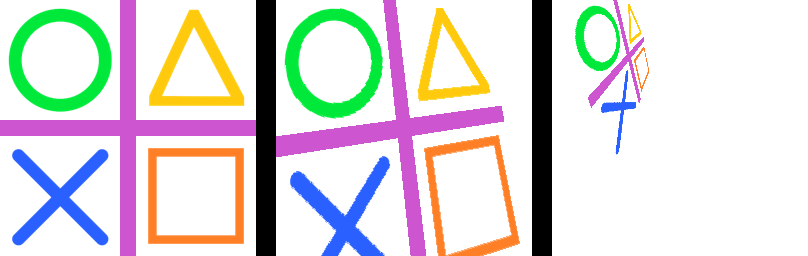

----

Transform.PERSPECTIVE coefficients
---------------------------------------

| Below is a standard numpy function to calculate hte coefficients required for a perspective transform where the quad coordinates are given.

.. code-block:: python

    from PIL import Image
    import numpy as np

    def find_coeffs(src, dst):
        matrix = []
        for (x, y), (X, Y) in zip(src, dst):
            matrix.extend([
                [x, y, 1, 0, 0, 0, -X * x, -X * y],
                [0, 0, 0, x, y, 1, -Y * x, -Y * y],
            ])
        A = np.matrix(matrix, dtype=float)
        B = np.array(dst).reshape(8)
        res = np.linalg.solve(A, B)
        return np.round(np.array(res).reshape(8), decimals=4)

    coeffs = find_coeffs(
            [(0, 0), (93, 256), (256 + 93, 256), (256, 0)],
            [(0, 0), (0, 256), (256, 256), (256, 0)]
            )
    # print(tuple(coeffs))

    im_new = im.transform((256 + 93, 256), Image.Transform.PERSPECTIVE, data=coeffs, resample=Image.Resampling.BICUBIC)
    im_new.save("image/transform_perspective_coeff.png")

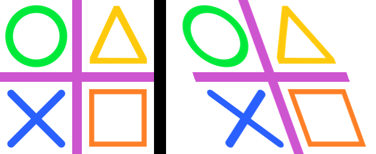

----

Transform.MESH 
------------------

| The code below has the same mesh classes as those in the ImageOps_deform section.
| An example of a mesh form each deform class is shown below.
| Cropping could be added to clip any black regions introduced by the deforms.

.. code-block:: python

    from PIL import Image, ImageOps
    import math

    class SingleDeformer:

        def getmesh(self, img):
            #Map a target rectangle onto a source quad
            return [(
                    # target rectangle
                    (0, 0, 256, 256),
                    # corresponding source quadrilateral
                    (0, 0, 0, 256, 256, 256, 350, -100)
                    )]

    class WaveDeformer:

        def __init__(self, gridspace=20, sin_period_factor=40, x_dir=True, y_dir=True):
            self.gridspace = gridspace
            self.sin_amp = gridspace / 2
            self.sin_period_factor = sin_period_factor
            self.x_dir = x_dir
            self.y_dir = y_dir

        def transform_y(self, x, y):
            y = y + self.sin_amp * math.sin(x / self.sin_period_factor)
            return x, y

        def transform_x(self, x, y):
            x = x + self.sin_amp * math.sin(y / self.sin_period_factor)
            return x, y

        def transform_xy(self, x, y):
            x = x + self.sin_amp * math.sin(y / self.sin_period_factor)
            y = y + self.sin_amp * math.sin(x / self.sin_period_factor)
            return x, y

        def transform_rectangle(self, x0, y0, x1, y1):
            if self.x_dir and self.y_dir: 
                return (*self.transform_xy(x0, y0),
                        *self.transform_xy(x0, y1),
                        *self.transform_xy(x1, y1),
                        *self.transform_xy(x1, y0),
                        )
            elif self.x_dir: 
                return (*self.transform_x(x0, y0),
                        *self.transform_x(x0, y1),
                        *self.transform_x(x1, y1),
                        *self.transform_x(x1, y0),
                        )
            elif self.y_dir: 
                return (*self.transform_y(x0, y0),
                        *self.transform_y(x0, y1),
                        *self.transform_y(x1, y1),
                        *self.transform_y(x1, y0),
                        )
            else: 
                return (*self.transform_xy(x0, y0),
                        *self.transform_xy(x0, y1),
                        *self.transform_xy(x1, y1),
                        *self.transform_xy(x1, y0),
                        )

        def getmesh(self, img):
            self.w, self.h = img.size
            self.gridspace
            target_grid = []
            for x in range(0, self.w, self.gridspace):
                for y in range(0, self.h, self.gridspace):
                    target_grid.append((x, y, x + self.gridspace, y + self.gridspace))
            source_grid = [self.transform_rectangle(*rect) for rect in target_grid]
            return [t for t in zip(target_grid, source_grid)]

    class BarrellDeformer:
    
        def __init__(self, gridspace=10, k_1=0.2, k_2=0.05):
            self.gridspace = gridspace
            self.k_1 = k_1
            self.k_2 = k_2
            # adjust k_1 and k_2 to achieve the required distortion

        def getmesh(self, img):
            self.w, self.h = img.size
            self.gridspace
            target_grid = []
            for x in range(0, self.w, self.gridspace):
                for y in range(0, self.h, self.gridspace):
                    target_grid.append((x, y, x + self.gridspace, y + self.gridspace))
            source_grid = [self.transform_rectangle(*rect) for rect in target_grid]
            return [t for t in zip(target_grid, source_grid)]
            
    
        def transform(self, x, y):
            # center and scale the grid for radius calculation (distance from center of image)
            x_c = self.w/2 
            y_c = self.h/2 
            x = (x - x_c) / x_c
            y = (y - y_c) / y_c
            radius = math.sqrt(x**2 + y**2) # distance from the center of image
            m_r = 1 + self.k_1 * radius + self.k_2 * radius**2 # radial distortion model
            # apply the model 
            x = x * m_r 
            y = y * m_r
            # reverse the initial shifting
            x = x * x_c + x_c
            y = y * y_c + y_c
            return x, y

        def transform_rectangle(self, x0, y0, x1, y1): 
            return (*self.transform(x0, y0),
                    *self.transform(x0, y1),
                    *self.transform(x1, y1),
                    *self.transform(x1, y0),
                    )

    with Image.open("test_images/cliffs.jpg") as im:
        mesh_data = SingleDeformer().getmesh(im)
        im_new = im.transform((256, 256), Image.Transform.MESH, data=mesh_data)
        # cropx, cropy = 32, 32
        # box = (cropx, cropy, im.width - cropx, im.height - cropy)
        # im_new = im_new.crop(box)

        im_new.save("image/transform_mesh0.png")
        
        mesh_data = WaveDeformer(gridspace=10, sin_period_factor=40, x_dir=True, y_dir=True).getmesh(im)
        im_new = im.transform((256, 256), Image.Transform.MESH, data=mesh_data)
        # im_new.show()
        im_new.save("image/transform_mesh1.png")

        mesh_data = BarrellDeformer(gridspace=20, k_1=0.2, k_2=0.05).getmesh(im)
        im_new = im.transform((256, 256), Image.Transform.MESH, data=mesh_data)
        # im_new.show()
        im_new.save("image/transform_mesh2.png")
        

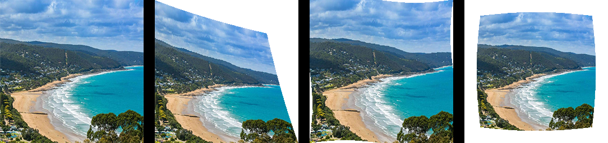

