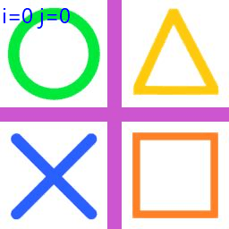
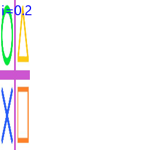
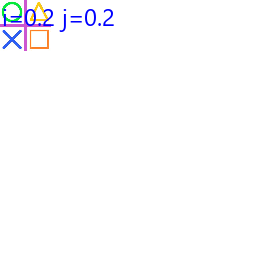
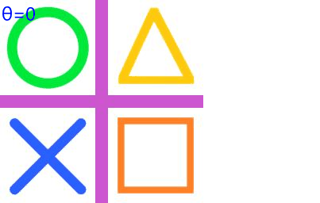
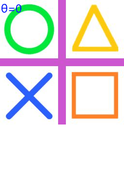
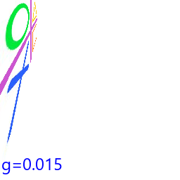
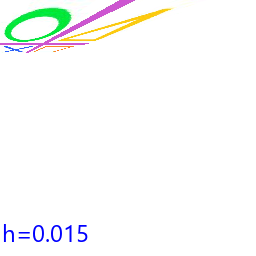
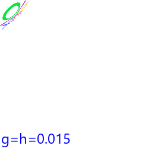
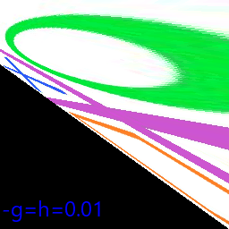
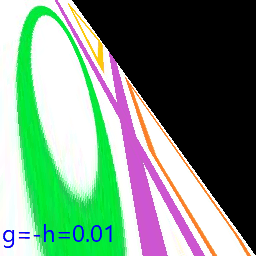

==========================
Image transform gifs
==========================

| Below are examples of gif made to show a variety of tranforms with changing arguments.
| See: https://note.nkmk.me/en/python-pillow-gif/
| See: https://pillow.readthedocs.io/en/latest/handbook/image-file-formats.html#gif

----

Transform.AFFINE translate
------------------------------

| The code below translates the image twice as far to the right as down.

.. code-block:: python

    from PIL import Image, ImageDraw, ImageFont

    def affine_translate(right=0, down=0):
        return (1, 0, -right, 0, 1, -down)

    im_path = "test_images/shapes.jpg"
    images = []
    font = ImageFont.truetype('C:/Windows/Fonts/Segoeui.ttf', 24)
    with Image.open(im_path) as im:
        for i in range(0, 64, 4):
            affine = affine_translate(right=2*i, down=i)
            im_new = im.transform(im.size, Image.Transform.AFFINE, data=affine, fillcolor=(255,255,255))
            draw = ImageDraw.Draw(im_new)
            # draw.rectangle([0, 216, im.width, 256], fill=(255,255,255))
            text = "i=" + str(2*i) + " j=" + str(i)
            draw.text((2, 0), text=text, font=font, fill=(0, 0, 255))
            images.append(im_new)

    images[0].save('new_gifs/transform_translate.gif',
                save_all=True, append_images=images[1:], optimize=False, duration=1000, loop=0) 

----

Transform.AFFINE dilate
------------------------------

| The code below dilates specified amounts in the x and y direction.

.. code-block:: python

    from PIL import Image, ImageDraw, ImageFont

        def affine_dilate(xfactor=1, yfactor=1):
            return (1 / xfactor, 0, 0, 0, 1 / yfactor, 0)

        im_path = "test_images/shapes.jpg"
        images = []
        font = ImageFont.truetype('C:/Windows/Fonts/Segoeui.ttf', 24)
        with Image.open(im_path) as im:
            for i in range(2, 41, 2):
                affine = affine_dilate(xfactor=i/10, yfactor=1)
                im_new = im.transform(im.size, Image.Transform.AFFINE, data=affine, fillcolor=(255,255,255))
                draw = ImageDraw.Draw(im_new)
                # draw.rectangle([0, 216, im.width, 256], fill=(255,255,255))
                text = "i=" + str(i/10)
                draw.text((2, 0), text=text, font=font, fill=(0, 0, 255))
                images.append(im_new)

        images[0].save('new_gifs/transform_dilate_x.gif',
                    save_all=True, append_images=images[1:], optimize=False, duration=500, loop=0) 

.. code-block:: python

    from PIL import Image, ImageDraw, ImageFont

        def affine_dilate(xfactor=1, yfactor=1):
            return (1 / xfactor, 0, 0, 0, 1 / yfactor, 0)

        im_path = "test_images/shapes.jpg"
        images = []
        font = ImageFont.truetype('C:/Windows/Fonts/Segoeui.ttf', 24)
        with Image.open(im_path) as im:
            for i in range(2, 41, 2):
                affine = affine_dilate(xfactor=i/10, yfactor=i/10)
                im_new = im.transform(im.size, Image.Transform.AFFINE, data=affine, fillcolor=(255,255,255))
                draw = ImageDraw.Draw(im_new)
                # draw.rectangle([0, 216, im.width, 256], fill=(255,255,255))
                text = "i=" + str(i/10) + " j=" + str(i/10)
                draw.text((2, 0), text=text, font=font, fill=(0, 0, 255))
                images.append(im_new)

        images[0].save('new_gifs/transform_dilate_xy.gif',
                    save_all=True, append_images=images[1:], optimize=False, duration=500, loop=0) 

----

Transform.AFFINE tilt_x
------------------------------

| The code below tilts the image in the x direction.

.. code-block:: python

    from PIL import Image, ImageDraw, ImageFont
    import math

        def affine_tilt_hor(im, theta):
            st = round(math.tan(math.radians(theta)), 3)
            w = im.width
            xshift = abs(st) * w
            new_w = w + int(xshift)
            affine = (1, st, -xshift if st > 0 else 0, 0, 1, 0)
            # print("affine_tilt_hor ", affine)
            return new_w, affine

        im_path = "test_images/shapes.jpg"
        images = []
        font = ImageFont.truetype('C:/Windows/Fonts/Segoeui.ttf', 24)
        with Image.open(im_path) as im:
            # get largest angle and largest size for images
            new_w, affine = affine_tilt_hor(im, theta=-30)
            new_size = (new_w, im.height)
            for i in range(0, -31, -2):
                new_w, affine = affine_tilt_hor(im, theta=i)
                im_new = im.transform(new_size, Image.Transform.AFFINE, data=affine, fillcolor=(255,255,255))
                draw = ImageDraw.Draw(im_new)
                # draw.rectangle([0, 216, im.width, 256], fill=(255,255,255))
                text = "θ=" + str(i)
                draw.text((2, 0), text=text, font=font, fill=(0, 0, 255))
                images.append(im_new)

        images[0].save('new_gifs/transform_tilt_x.gif',
                    save_all=True, append_images=images[1:], optimize=False, duration=500, loop=0) 

----

Transform.AFFINE tilt_y
------------------------------

| The code below translates the image twice as far to the right as down.

.. code-block:: python

    from PIL import Image, ImageDraw, ImageFont
    import math

    def affine_tilt_vert(im, theta):
        ct = round(math.tan(math.radians(theta)), 3)
        h = im.height
        yshift = abs(ct) * h
        new_h = h + int(yshift)
        affine = (1, 0, 0, ct, 1, -yshift if ct > 0 else 0)
        # print("affine_tilt_vert ", affine)
        return new_h, affine

    im_path = "test_images/shapes.jpg"
    images = []
    font = ImageFont.truetype('C:/Windows/Fonts/Segoeui.ttf', 24)
    with Image.open(im_path) as im:
        # get largest angle and largest size for images
        new_h, affine = affine_tilt_vert(im, theta=-30)
        new_size = (im.width, new_h)
        for i in range(0, -31, -2):
            new_h, affine = affine_tilt_vert(im, theta=i)
            im_new = im.transform(new_size, Image.Transform.AFFINE, data=affine, fillcolor=(255,255,255))
            draw = ImageDraw.Draw(im_new)
            # draw.rectangle([0, 216, im.width, 256], fill=(255,255,255))
            text = "θ=" + str(i)
            draw.text((2, 0), text=text, font=font, fill=(0, 0, 255))
            images.append(im_new)

    images[0].save('new_gifs/transform_tilt_y.gif',
                save_all=True, append_images=images[1:], optimize=False, duration=500, loop=0) 

----

Transform.PERSPECTIVE g
------------------------------

| The code below iterates over g values in the 8-tuple coefficients.

.. code-block:: python

    from PIL import Image, ImageDraw, ImageFont

    def get_perspective_gh(g=0, h=0):
        return (1, 0, 0, 0, 1, 0, g/1000, h/1000)

    im_path = "test_images/shapes.jpg"
    images = []
    font = ImageFont.truetype('C:/Windows/Fonts/Segoeui.ttf', 24)
    with Image.open(im_path) as im:
        for i in range(-15, 11, 1):
            perspective = get_perspective_gh(g=i, h=0)
            new_im = im.transform((256, 256), Image.Transform.PERSPECTIVE, data=perspective, fillcolor=(255,255,255))
            draw = ImageDraw.Draw(new_im)
            # draw.rectangle([0, 216, im.width, 256], fill=(255,255,255))
            text = "g=" + str(-i/1000)
            draw.text((2, 216), text=text, font=font, fill=(0, 0, 255))
            images.append(new_im)

        images[0].save('new_gifs/perspective_g.gif',
                    save_all=True, append_images=images[1:], optimize=False, duration=500, loop=0) 

----
Transform.PERSPECTIVE h
------------------------------

| The code below iterates over h values in the 8-tuple coefficients.

.. code-block:: python

    from PIL import Image, ImageDraw, ImageFont

    def get_perspective_gh(g=0, h=0):
        return (1, 0, 0, 0, 1, 0, g/1000, h/1000)

    images = []
    font = ImageFont.truetype('C:/Windows/Fonts/Segoeui.ttf', 24)
    with Image.open(im_path) as im:
        for i in range(-15, 11, 1):
            perspective = get_perspective_gh(g=0, h=i)
            new_im = im.transform((256, 256), Image.Transform.PERSPECTIVE, data=perspective, fillcolor=(255,255,255))
            draw = ImageDraw.Draw(new_im)
            # draw.rectangle([0, 216, im.width, 256], fill=(255,255,255))
            text = "h=" + str(-i/1000)
            draw.text((2, 216), text=text, font=font, fill=(0, 0, 255))
            images.append(new_im)

    images[0].save('new_gifs/perspective_h.gif',
                save_all=True, append_images=images[1:], optimize=False, duration=500, loop=0) 

----

Transform.PERSPECTIVE g h
------------------------------

| The code below iterates over g and h values in the 8-tuple coefficients.

.. code-block:: python

    from PIL import Image, ImageDraw, ImageFont

    def get_perspective_gh(g=0, h=0):
        return (1, 0, 0, 0, 1, 0, g/1000, h/1000)

    images = []
    font = ImageFont.truetype('C:/Windows/Fonts/Segoeui.ttf', 24)
    with Image.open(im_path) as im:
        for i in range(-15, 11, 1):
            perspective = get_perspective_gh(g=i, h=i)
            new_im = im.transform((256, 256), Image.Transform.PERSPECTIVE, data=perspective, fillcolor=(255,255,255))
            draw = ImageDraw.Draw(new_im)
            # draw.rectangle([0, 216, im.width, 256], fill=(255,255,255))
            text = "g=h=" + str(-i/1000)
            draw.text((2, 216), text=text, font=font, fill=(0, 0, 255))
            images.append(new_im)

    images[0].save('new_gifs/perspective_gh.gif',
                save_all=True, append_images=images[1:], optimize=False, duration=500, loop=0) 

----

Transform.PERSPECTIVE -g h
------------------------------

| The code below iterates over -g and h values in the 8-tuple coefficients.

.. code-block:: python

    from PIL import Image, ImageDraw, ImageFont

    def get_perspective_gh(g=0, h=0):
        return (1, 0, 0, 0, 1, 0, g/1000, h/1000)

    images = []
    font = ImageFont.truetype('C:/Windows/Fonts/Segoeui.ttf', 24)
    with Image.open(im_path) as im:
        for i in range(-10, 11, 1):
            perspective = get_perspective_gh(g=-i, h=i)
            new_im = im.transform((256, 256), Image.Transform.PERSPECTIVE, data=perspective)
            draw = ImageDraw.Draw(new_im)
            # draw.rectangle([0, 216, im.width, 256], fill=(255,255,255))
            text = "-g=h=" + str(-i/1000)
            draw.text((2, 216), text=text, font=font, fill=(0, 0, 255))
            images.append(new_im)

    images[0].save('new_gifs/perspective_-gh.gif',
                save_all=True, append_images=images[1:], optimize=False, duration=500, loop=0) 

----

Transform.PERSPECTIVE g -h
------------------------------

| The code below iterates over g and -h values in the 8-tuple coefficients.

.. code-block:: python

    from PIL import Image, ImageDraw, ImageFont

    def get_perspective_gh(g=0, h=0):
        return (1, 0, 0, 0, 1, 0, g/1000, h/1000)

    images = []
    font = ImageFont.truetype('C:/Windows/Fonts/Segoeui.ttf', 24)
    with Image.open(im_path) as im:
        for i in range(-10, 11, 1):
            perspective = get_perspective_gh(g=i, h=-i)
            new_im = im.transform((256, 256), Image.Transform.PERSPECTIVE, data=perspective)
            draw = ImageDraw.Draw(new_im)
            # draw.rectangle([0, 216, im.width, 256], fill=(255,255,255))
            text = "g=-h=" + str(-i/1000)
            draw.text((2, 216), text=text, font=font, fill=(0, 0, 255))
            images.append(new_im)

    images[0].save('new_gifs/perspective_g-h.gif',
                save_all=True, append_images=images[1:], optimize=False, duration=500, loop=0) 

