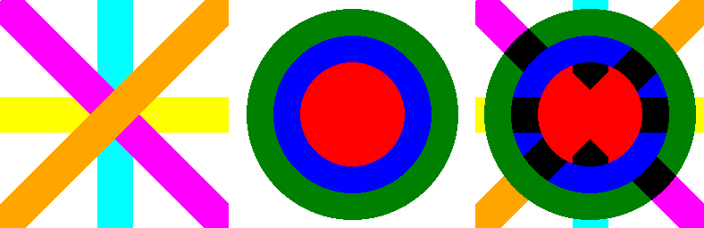
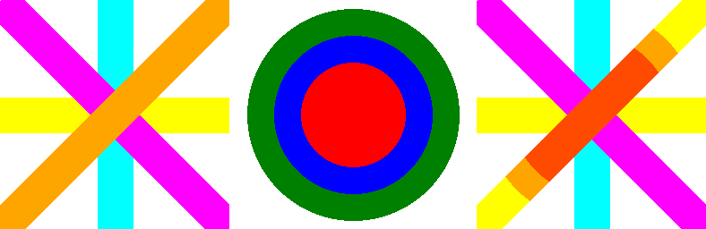

==========================
ImageChops introduction
==========================

| See: https://pillow.readthedocs.io/en/stable/reference/ImageChops.html#PIL.ImageChops
| See: https://en.wikipedia.org/wiki/Blend_modes

| The ImageChops module contains a number of arithmetical image operations, called channel operations ("chops").
| For more pre-made operations, see ImageOps.
| At this time, most channel operations are only implemented for 8-bit images (e.g. "L" and "RGB").
| Most channel operations take one or two image arguments and return a new image.
| The result of a channel operation is always clipped to the range 0 to 255.

----

| Below is a list of ImageImageChops methods.
| Most take 2 images as input. 
| The right hand image is the output.

| ImageChops_add
.. image:: images/compare_add.png
    :scale: 30%
    :align: center

| 
| ImageChops_add_modulo

| 
| ImageChops_blend
.. image:: images/compare_blend.png
    :scale: 30%
    :align: center

| 
| ImageChops_composite
.. image:: images/compare_composite.png
    :scale: 30%
    :align: center

| 
| ImageChops_constant
.. image:: images/constant.png
    :scale: 30%
    :align: center

| 
| ImageChops_darker

| 
| ImageChops_difference
.. image:: images/compare_difference.png
    :scale: 30%
    :align: center

| 
| ImageChops_duplicate (The copy has been converted to greyscale)
.. image:: images/compare_duplicate.png
    :scale: 30%
    :align: center

| 
| ImageChops_invert
.. image:: images/compare_invert.png
    :scale: 30%
    :align: center

| 
| ImageChops_lighter

| 
| ImageChops_logical_and

| 
| ImageChops_logical_or

| 
| ImageChops_logical_xor

| 
| ImageChops_multiply
.. image:: images/compare_multiply.png
    :scale: 30%
    :align: center

| 
| ImageChops_soft_light
.. image:: images/compare_soft_light.png
    :scale: 30%
    :align: center

| 
| ImageChops_hard_light

| 
| ImageChops_overlay

| 
| ImageChops_offset
.. image:: images/compare_offset.png
    :scale: 30%
    :align: center

| 
| ImageChops_screen

| 
| ImageChops_subtract
.. image:: images/compare_subtract.png
    :scale: 30%
    :align: center

| 
| ImageChops_subtract_modulo
.. image:: images/compare_subtract_modulo.png
    :scale: 30%
    :align: center
