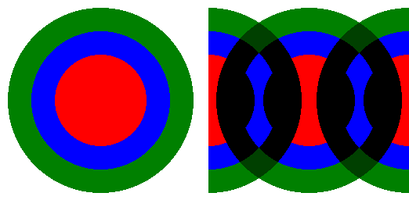

==========================
ImageChops offset
==========================

| See: https://pillow.readthedocs.io/en/stable/reference/ImageChops.html#PIL.ImageChops.offset

----

Offset
---------------------------

| Use the ``ImageChopsoffset(image, xoffset, yoffset=None)`` method to copy an image with an offset given by the given distances. Data wraps around the edges. If yoffset is omitted, it is assumed to be equal to xoffset.

.. code-block:: python

    from PIL import Image, ImageChops

    with Image.open("test_images/circles.png") as im1:
        im1off = ImageChops.offset(im1, 128, 0)
        im_out = ImageChops.multiply(im1, im1off)
        im_out.save("chops/offset.png")

