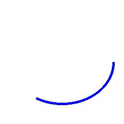

==========================
ImageDraw arc
==========================

| See: https://pillow.readthedocs.io/en/stable/reference/ImageDraw.html#PIL.ImageDraw.ImageDraw.arc

----

Arc
----------------------

| Use the ``ImageDraw.arc(xy, start, end, fill=None, width=0)`` method to draw an arc (a portion of a circle outline) between the start and end angles, inside the given bounding box.

.. py:function:: ImageDraw.arc(xy, start, end, fill=None, width=0)
    
    | **xy** - Two points to define the bounding box. Sequence of [(x0, y0), (x1, y1)] or [x0, y0, x1, y1], where x1 >= x0 and y1 >= y0.
    | **start** - Starting angle, in degrees. Angles are measured from 3 o'clock, increasing clockwise.
    | **end** - Ending angle, in degrees.
    | **fill** - Color to use for the arc.
    | **width** - The line width, in pixels.

| The code below draws a blue arc on a new white image.

.. code-block:: python

    from PIL import Image, ImageDraw

    im = Image.new('RGB', (256, 256), "white")
    drw = ImageDraw.Draw(im, 'RGB')

    # im.show()
    drw.arc(xy=(20, 40, 236, 216), start=0, end=120, fill="blue", width=5)
    im.save("ImageDraw/ImageDraw_arc.jpg")

