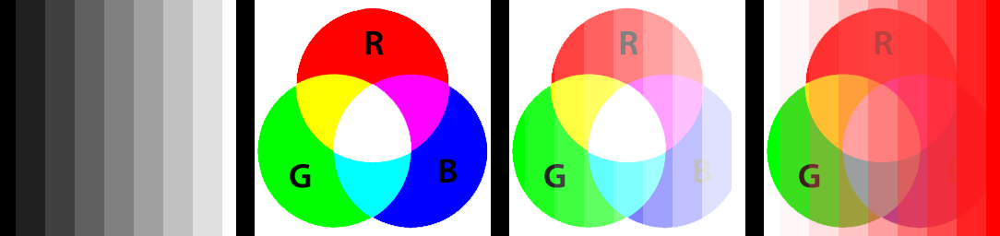

==========================
ImageDraw bitmap
==========================

| See: https://pillow.readthedocs.io/en/stable/reference/ImageDraw.html#PIL.ImageDraw.ImageDraw.bitmap

----

Bitmap
----------------------

| Use the ``ImageDraw.bitmap(xy, bitmap, fill=None)`` method to draw a bitmap (mask) at the given position, using the current fill color for the non-zero portions. 
| The **bitmap** should be a valid transparency mask (mode “1”) or matte (mode “L” or “RGBA”).
| The **fill** color is used for the non-zero portions of the bitmap.

.. code-block:: python

    from PIL import Image, ImageDraw

    with Image.open("test_images/greyscale_vert_gradient_32.png") as img1:
        with Image.open("test_images/rgb_colors.png") as img2:
            img1_bitmap = img1.convert("L")
            
            img2_drw = ImageDraw.Draw(img2)
            img2_drw.bitmap((0,0), img1_bitmap)   
            # img2.show()
            img2.save("ImageDraw/ImageDraw_bitmap.png")

            img2_drw = ImageDraw.Draw(img2)
            img2_drw.bitmap((0,0), img1_bitmap, fill=(255,0,0))   
            # img2.show()
            img2.save("ImageDraw/ImageDraw_bitmap_red.png")

