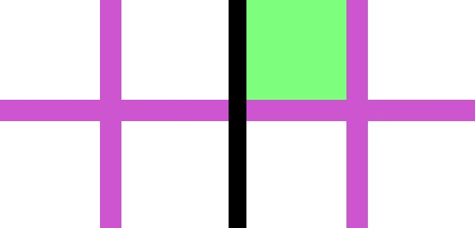

==========================
ImageDraw floodfill
==========================

| See: https://pillow.readthedocs.io/en/stable/reference/ImageDraw.html#PIL.ImageDraw.ImageDraw.floodfill

----

Floodfill
----------------------

| Use the ``ImageDraw.floodfill(image, xy, value, border=None, thresh=0)`` method to fill a bounded region with a given color, modifying the image in place.

.. py:function:: ImageDraw.floodfill(image, xy, value, border=None, thresh=0)

    | **xy** - Seed position (a 2-item coordinate tuple).
    | **value** - Fill color.
    | **border** - Optional border value. If given, the region consists of pixels with a color different from the border color. If not given, the region consists of pixels having the same color as the seed pixel.
    | **thresh** - Optional threshold value which specifies a maximum tolerable difference of a pixel value from the background in order for it to be replaced. Useful for filling regions of non- homogeneous, but similar, colors.

| The code below flood-fills the top left area of the image.

.. code-block:: python

    from PIL import Image, ImageDraw

    with Image.open("shapes_jpgs/plus.jpg") as im:
        seed = (20, 20)
        value = (125, 255, 125)
        ImageDraw.floodfill(im, seed, value, thresh=50)
        # im.show()
        im.save("ImageDraw/ImageDraw_floodfill.jpg")

