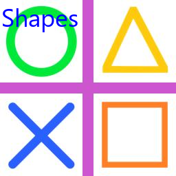
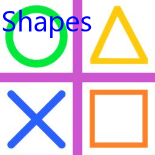
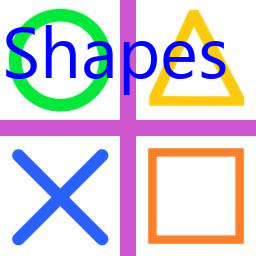

==========================
ImageDraw font
==========================

| See: https://pillow.readthedocs.io/en/stable/reference/ImageDraw.html#PIL.ImageDraw.ImageDraw.font

----

Font
----------------------

| Use the ``ImageDraw.font = ImageFont.truetype(font)`` attribute to set the draw font.

| The code below sets the font for the drawing object: 
| ``drw.font = ImageFont.truetype("C:/Windows/Fonts/Segoeui.ttf", 24)``

.. code-block:: python

    from PIL import Image, ImageDraw, ImageFont

    fnt = ImageFont.truetype("C:/Windows/Fonts/Segoeui.ttf", 36)
    with Image.open("test_images/shapes.jpg") as im:
        drw = ImageDraw.Draw(im)
        text = "Shapes"
        drw.text((2, 0), text=text, font=fnt, fill=(0, 0, 255))
        # im.show()
        im.save("ImageDraw/ImageDraw_font1.png")
        

----

| The code below achieves the same result.

.. code-block:: python

    from PIL import Image, ImageDraw, ImageFont

    with Image.open("test_images/shapes.jpg") as im:
        drw = ImageDraw.Draw(im)
        text = "Shapes"
        drw.font = ImageFont.truetype("C:/Windows/Fonts/Segoeui.ttf", 48)
        drw.text((2, 0), text=text, fill=(0, 0, 255))
        # im.show()
        im.save("ImageDraw/ImageDraw_font2.png")

----

| The code below sets the global font for the drawing object: 
| ``ImageDraw.ImageDraw.font = ImageFont.truetype("C:/Windows/Fonts/Segoeui.ttf", 72)``

.. code-block:: python

    from PIL import Image, ImageDraw, ImageFont

    #set global font
    ImageDraw.ImageDraw.font = ImageFont.truetype("C:/Windows/Fonts/Segoeui.ttf", 72)
    with Image.open("test_images/shapes.jpg") as im:
        drw = ImageDraw.Draw(im)
        text = "Shapes"
        drw.text((2, 0), text=text, fill=(0, 0, 255))
        # im.show()
        im.save("ImageDraw/ImageDraw_font3.png")

