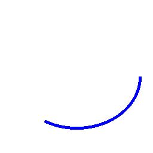
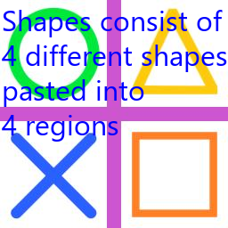
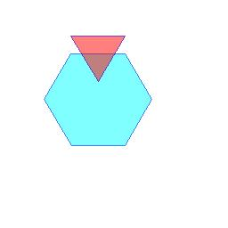
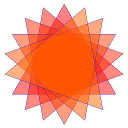

==========================
ImageDraw introduction
==========================

| See: https://pillow.readthedocs.io/en/stable/reference/ImageDraw.html

| See: https://www.blog.pythonlibrary.org/2021/02/23/drawing-shapes-on-images-with-python-and-pillow/
| For HTML colour names that can be used See: https://www.w3schools.com/tags/ref_colornames.asp

| The ImageDraw module provides simple 2D graphics for Image objects. You can use this module to create new images, annotate or retouch existing images, and to generate graphics on the fly.

| Below is a list of ImageDraw methods.

----

Drawing
---------------------------

| ImageDraw.arc

| 
| ImageDraw.bitmap
.. image:: images/ImageDraw_compare_bitmap.png
    :scale: 50%
    :align: center

| 
| ImageDraw.chord
.. image:: images/ImageDraw_chord.jpg
    :scale: 50%
    :align: center

| 
| ImageDraw.ellipse
.. image:: images/ImageDraw_ellipse.jpg
    :scale: 50%
    :align: center

| 
| ImageDraw.floodfill
.. image:: images/ImageDraw_compare_floodfill.png
    :scale: 50%
    :align: center

| 
| ImageDraw.line
.. image:: images/ImageDraw_line.jpg
    :scale: 50%
    :align: center

| 
| ImageDraw.multiline_text

| 
| ImageDraw.pieslice
.. image:: images/ImageDraw_pieslice.png
    :scale: 50%
    :align: center

| 
| ImageDraw.point

| 
| ImageDraw.polygon

| 
| ImageDraw.rectangle
.. image:: images/ImageDraw_rectangle.jpg
    :scale: 50%
    :align: center

| 
| ImageDraw.ImageDraw_regular_polygon

| 
| ImageDraw.rounded_rectangle
.. image:: images/ImageDraw_rounded_rectangle.jpg
    :scale: 50%
    :align: center

| 
| ImageDraw.shape
.. image:: images/ImageDraw_shape.jpg
    :scale: 50%
    :align: center

| 
| ImageDraw.text

