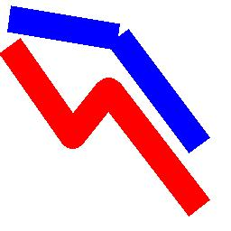

==========================
ImageDraw line
==========================

| See: https://pillow.readthedocs.io/en/stable/reference/ImageDraw.html#PIL.ImageDraw.ImageDraw.line

----

Line
----------------------

| Use the ``ImageDraw.line(xy, fill=None, width=0, joint=None)`` method to draw a line between the coordinates in the xy list.

.. py:function:: ImageDraw.line(xy, fill=None, width=0, joint=None)

    | **xy** - Sequence of either 2-tuples like [(x, y), (x, y), ...] or numeric values like [x, y, x, y, ...].
    | **fill** - Color to use for the line.
    | **width** - The line width, in pixels.
    | **joint** - Joint type between a sequence of lines. It can be "curve", for rounded edges, or None.

| The code below draws a blue line with no joint, and a red line with a curved joint.

.. code-block:: python

    from PIL import Image, ImageDraw

    im = Image.new('RGB', (256, 256), "white")
    drw = ImageDraw.Draw(im, 'RGB')

    line1_points = [(10, 20), (130, 40), (220, 160)]
    line2_points = [(10, 50), (80, 150), (120, 100), (220, 230)]

    drw.line(xy=line1_points, fill="blue", width=30)
    drw.line(xy=line2_points, fill="red", width=30, joint="curve")
    # im.show()
    im.save("ImageDraw/ImageDraw_line.jpg")

