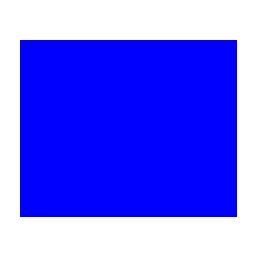

==========================
ImageDraw multiline_text
==========================

| See: https://pillow.readthedocs.io/en/stable/reference/ImageDraw.html#PIL.ImageDraw.ImageDraw.multiline_text

----

Draw
----------------------

| Use the ``ImageDraw.Draw(im, mode=None)`` method to create  a new draw object that can be used to draw in the given image, modifying the image, **in place**.
| **mode** - Optional mode to use for color values. For RGB images, this argument can be RGB or RGBA (to blend the drawing into the image). For all other modes, this argument must be the same as the image mode. If omitted, the mode defaults to the mode of the image.

| The code below draws a blue rectangle on a new white image.
| Firstly, a new image, ``im``, is made: ``im = Image.new('RGB', (256, 256), "white")``
| The image, im, is passed into the Draw method: ``drw = ImageDraw.Draw(im, 'RGB')``.
| Then a rectangle is drawn.
| Then the image is saved.

.. code-block:: python

    from PIL import Image, ImageDraw

    im = Image.new('RGB', (256, 256), "white")
    drw = ImageDraw.Draw(im, 'RGB')

    drw.rectangle((20, 40, 236, 216), fill ="blue")
    im.save("ImageDraw/ImageDraw_draw.jpg")

