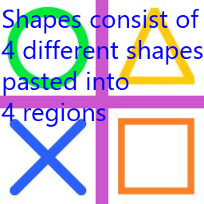

==========================
ImageDraw multiline_text
==========================

| See: https://pillow.readthedocs.io/en/stable/reference/ImageDraw.html#PIL.ImageDraw.ImageDraw.multiline_text

----

Multiline_text
----------------------

| Use the ``ImageDraw.multiline_text()`` method to draws the string at the given position.

.. py:function:: ImageDraw.text(xy, text, fill=None, font=None, anchor=None, spacing=4, align='left', direction=None, features=None, language=None, stroke_width=0, stroke_fill=None, embedded_color=False)

    | **xy** - The anchor coordinates of the text.
    | **text** - String to be drawn.
    | **fill** - Color to use for the text.
    | **font** - An ImageFont instance.
    | **anchor** - The text anchor alignment determines the relative location of the anchor to the text. The default alignment is top left. This parameter is ignored for non-TrueType fonts.
    | **spacing** - The number of pixels between lines.
    | **align** - "left", "center" or "right". Determines the relative alignment of lines. Use the anchor parameter to specify the alignment to xy.
    | **direction** - Direction of the text. It can be "rtl" (right to left), "ltr" (left to right) or "ttb" (top to bottom). Requires **libraqm**.
    | **features** - A list of OpenType font features to be used during text layout. This is usually used to turn on optional font features that are not enabled by default, for example "dlig" or "ss01", but can be also used to turn off default font features, for example "-liga" to disable ligatures or "-kern" to disable kerning. To get all supported features, see OpenType docs. Requires **libraqm**.
    | **language** - Language of the text. Different languages may use different glyph shapes or ligatures. This parameter tells the font which language the text is in, and to apply the correct substitutions as appropriate, if available. It should be a BCP 47 language code. Requires **libraqm**.
    | **stroke_width** - The width of the text stroke.
    | **stroke_fill** - Color to use for the text stroke. If not given, will default to the fill parameter.
    | **embedded_color** - Whether to use font embedded color glyphs (COLR, CBDT, SBIX).

| Then the image is saved.

.. code-block:: python

    from PIL import Image, ImageDraw, ImageFont

    fnt = ImageFont.truetype("C:/Windows/Fonts/Segoeui.ttf", 32)
    with Image.open("test_images/shapes.jpg") as im:
        drw = ImageDraw.Draw(im)
        text = "Shapes consist of \n4 different shapes \npasted into \n4 regions"
        drw.multiline_text((2, 0), text=text, font=fnt, fill=(0, 0, 255))
        # im.show()
        im.save("ImageDraw/ImageDraw_multiline_text.png")

