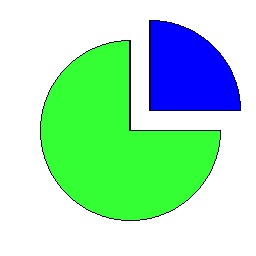

==========================
ImageDraw pieslice
==========================

| See: https://pillow.readthedocs.io/en/stable/reference/ImageDraw.html#PIL.ImageDraw.ImageDraw.pieslice

----

Pieslice
----------------------

| Use the ``ImageDraw.pieslice(xy, start, end, fill=None, outline=None, width=1)`` method to draw a pieslice like an arc with straight lines between the end points and the center of the bounding box. This modifies the image, **in place**.

.. py:function:: ImageDraw.pieslice(xy, start, end, fill=None, outline=None, width=1)

    | **xy** - Two points to define the bounding box. 
    | Sequence of ``[(x0, y0), (x1, y1)]`` or ``[x0, y0, x1, y1]``, where ``x1 >= x0`` and ``y1 >= y0``.
    | **start** - Starting angle, in degrees. Angles are measured from 3 o'clock, increasing clockwise.
    | **end** - Ending angle, in degrees.
    | **fill** - Color to use for the fill.
    | **outline** - Color to use for the outline.
    | **width** - The line width, in pixels.

| The code below draws a blue rectangle on a new white image.

.. code-block:: python

    from PIL import Image, ImageDraw

    im = Image.new('RGB', (256, 256), "white")
    drw = ImageDraw.Draw(im, 'RGB')

    shape = [(40, 40), (220, 220)]   
    drw.pieslice(shape, start = 0, end = 270, fill ="#33ff33", outline ="#000033")

    shape = [(60, 20), (240, 200)]   
    drw.pieslice(shape, start = 270, end = 360, fill ="#0000ff", outline ="#000033")

    im.save("ImageDraw/ImageDraw_pieslice.png")
    # im.show()

