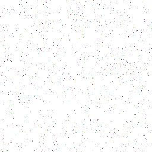

==========================
ImageDraw point
==========================

| See: https://pillow.readthedocs.io/en/stable/reference/ImageDraw.html#PIL.ImageDraw.ImageDraw.point

----

Point
----------------------

| Use the ``ImageDraw.point(xy, fill=None)`` mehtod to draws points (individual pixels) at the given coordinates.

.. py:function:: ImageDraw.point(xy, fill=None)

    | **xy** - Sequence of either 2-tuples like [(x, y), (x, y), ...] or numeric values like [x, y, x, y, ...].
    | **fill** - Color to use for the point.

| The code below draws 1000 random points with random colours.

.. code-block:: python

    from PIL import Image, ImageDraw
    import random

    im = Image.new('RGB', (256, 256), "white")
    drw = ImageDraw.Draw(im, 'RGB')

    for i in range(1000):
        col = (random.randint(0, 255), random.randint(0, 255), random.randint(0, 255))
        pos = (random.randint(0, im.width), random.randint(0, im.height))
        drw.point(xy=pos, fill=col)
    # im.show()
    im.save("ImageDraw/ImageDraw_point.jpg")

