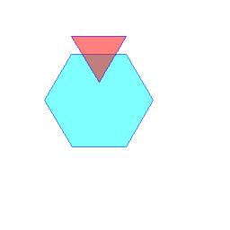

==========================
ImageDraw polygon
==========================

| See: https://pillow.readthedocs.io/en/stable/reference/ImageDraw.html#PIL.ImageDraw.ImageDraw.polygon

----

Polygon
----------------------

| Use the ``ImageDraw.polygon(xy, fill=None, outline=None, width=1)`` method to draw a polygon.
| The polygon outline consists of straight lines between the given coordinates, plus a straight line between the last and the first coordinate.

.. py:function:: ImageDraw.polygon(xy, fill=None, outline=None, width=1)

    | **fill** - Color to use for the fill.
    | **outline** - Color to use for the outline.
    | **width** - The line width, in pixels.

| The code below draws a hexagon and a triangle.
| The ``polygon_points`` function returns the points for a polygon.

.. code-block:: python

    from PIL import Image, ImageDraw
    import math

    im = Image.new('RGB', (256, 256), "white")
    drw = ImageDraw.Draw(im, 'RGBA')

    def polygon_points(edge_length=30, edges=3, offset=(0, 0)):
        """return polygon points"""
        x, y = offset
        points = []
        angle_step = 360//edges
        for angle in range(0, 360, angle_step):
            x += math.cos(math.radians(angle)) * edge_length
            y += math.sin(math.radians(angle)) * edge_length
            points.append((x, y))
        return points

    hexagon = polygon_points(edge_length=60, edges=6, offset=(80, 60))
    drw.polygon(hexagon, outline=(0, 0, 255, 128), fill=(0, 255, 255, 128))

    triangle = polygon_points(edge_length=60, edges=3, offset=(80, 40))
    drw.polygon(triangle, outline=(0, 0, 255, 128), fill=(255, 0, 0, 128))

    # im.show()
    im.save("ImageDraw/ImageDraw_polygon.jpg")

