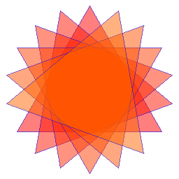

==========================
ImageDraw regular_polygon
==========================

| See: https://pillow.readthedocs.io/en/stable/reference/ImageDraw.html#PIL.ImageDraw.ImageDraw.regular_polygon

| To draw polygons that are transparent, relative to each other, the base Image has to be of type RGB, not RGBA, and the ImageDraw has to be of type RGBA.

----

Regular_polygon
----------------------

| Use the ``ImageDraw.regular_polygon(bounding_circle, n_sides, rotation=0, fill=None, outline=None)``
method to draw a regular polygon inscribed in bounding_circle, with n_sides, and rotation of rotation degrees.

.. py:function:: ImageDraw.regular_polygon(bounding_circle, n_sides, rotation=0, fill=None, outline=None)

    | **bounding_circle** - The bounding circle is a tuple defined by a point and radius. (e.g. bounding_circle=(x, y, r) or ((x, y), r)). The polygon is inscribed in this circle.
    | **n_sides** - Number of sides (e.g. n_sides=3 for a triangle, 6 for a hexagon).
    | **rotation** - Apply an arbitrary rotation to the polygon (e.g. rotation=90, applies a 90 degree rotation).
    | **fill** - Color to use for the fill.
    | **outline** - Color to use for the outline.

| The code below draws a series of 6 triangles rotated about their centre.
| The **fill** uses **i** from the **for loop** to alter the colour.

.. code-block:: python

    from PIL import Image, ImageDraw

    im = Image.new('RGB', (256, 256), (255, 255, 255))
    drw = ImageDraw.Draw(im, 'RGBA')

    for i in range(0, 120, 20)
        drw.regular_polygon((128, 128, 120), 3, rotation=i, fill=(255, i, 0, 128), outline=(0, 0, 255, 128))
    im.show()
    im.save("ImageDraw/ImageDraw_regular_polygon.png")

