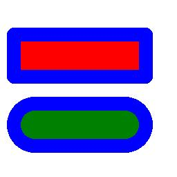

==========================
ImageDraw rounded_rectangle
==========================

| See: https://pillow.readthedocs.io/en/stable/reference/ImageDraw.html#PIL.ImageDraw.ImageDraw.rounded_rectangle

----

Rounded rectangle
----------------------

| Use the ``ImageDraw.rounded_rectangle(xy, radius=0, fill=None, outline=None, width=1)`` method to draw rounded rectangle.

.. py:function:: ImageDraw.rounded_rectangle(xy, radius=0, fill=None, outline=None, width=1)

    | **xy** - Two points to define the bounding box. Sequence of either [(x0, y0), (x1, y1)] or [x0, y0, x1, y1]. The bounding box is inclusive of both endpoints.
    | **radius** - Radius of the corners.
    | **fill** - Color to use for the fill.
    | **outline** - Color to use for the outline.
    | **width** - The line width, in pixels.

| The code below draws 2 rounded rectangles.

.. code-block:: python

    from PIL import Image, ImageDraw

    im = Image.new('RGB', (256, 256), "white")
    drw = ImageDraw.Draw(im, 'RGB')

    box1 = [(10, 40), (220, 120)]
    box2 = [(10, 140), (220, 220)]

    drw.rounded_rectangle(xy=box1, radius=10, fill="red", outline="blue", width=20)
    drw.rounded_rectangle(xy=box2, radius=100, fill="green", outline="blue", width=20)
    # im.show()
    im.save("ImageDraw/ImageDraw_rounded_rectangle.jpg")

