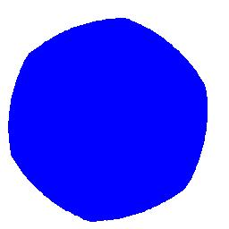

==========================
ImageDraw shape
==========================

| See: https://pillow.readthedocs.io/en/stable/reference/ImageDraw.html#PIL.ImageDraw.ImageDraw.Shape

----

Shape
----------------------

| Use the ``ImageDraw.shape(shape, fill=None, outline=None)`` method to draw a shape.
| This is experimental.
| The **shape** object is produced via ImageDraw.Outline() and its move, line and curve methods.
| **fill** - Color to use for the fill.
| **outline** - Color to use for the outline.

| The code below draws a shape using points generated by the ``polygon_points`` function.
| The use of  ``ImageDraw.Outline()`` is undocumented.
| Use ``move`` to go to the first point (x0, y0).
| Use ``line`` to draw to the next point (x1, y1).
| Use ``curve`` to draw a curve between 3 points (x1, y1, x2, y2, x3, y3).

.. code-block:: python

    from PIL import Image, ImageDraw
    import math

    im = Image.new("RGB", (256, 256), "white")
    drw = ImageDraw.Draw(im, "RGBA")

    def polygon_points(edge_length=30, edges=3, offset=(0, 0)):
        """return polygon points"""
        x, y = offset
        points = []
        angle_step = 360 // edges
        for angle in range(0, 360, angle_step):
            x += math.cos(math.radians(angle)) * edge_length
            y += math.sin(math.radians(angle)) * edge_length
            points.append((x, y))
        points.append(points[0])
        return points

    polyg = polygon_points(edge_length=40, edges=18, offset=(100, 20))

    s = ImageDraw.Outline()
    s.move(polyg[0][0], polyg[0][1])
    for i in range(1, len(polyg)-2, 3):
        s.curve(polyg[i][0], polyg[i][1], polyg[i+1][0], polyg[i+1][1], polyg[i+2][0], polyg[i+2][1])
    # for i in range(1, len(polyg)):
    #     s.line(polyg[i][0], polyg[i][1])

    drw.shape(s, outline="blue")
    # im.show()
    im.save("ImageDraw/ImageDraw_shape.jpg")

