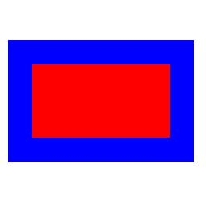

==========================
ImageDraw textlength
==========================

| See: https://pillow.readthedocs.io/en/stable/reference/ImageDraw.html#PIL.ImageDraw.ImageDraw.textlength

----

Textlength
----------------------

| Use the ``ImageDraw.textlength(text, font=None, direction=None, features=None, language=None, embedded_color=False)`` method to return the length (in pixels as a float) of given text

.. py:function:: ImageDraw.textlength(text, font=None, direction=None, features=None, language=None, embedded_color=False)

    | **xy** - 

    :param text: Text to be measured. May not contain any newline characters.
    :param font: An :py:class:`~PIL.ImageFont.ImageFont` instance.
    :param direction: Direction of the text. It can be ``"rtl"`` (right to
                      left), ``"ltr"`` (left to right) or ``"ttb"`` (top to bottom).
                      Requires libraqm.
    :param features: A list of OpenType font features to be used during text
                     layout. This is usually used to turn on optional
                     font features that are not enabled by default,
                     for example ``"dlig"`` or ``"ss01"``, but can be also
                     used to turn off default font features, for
                     example ``"-liga"`` to disable ligatures or ``"-kern"``
                     to disable kerning.  To get all supported
                     features, see `OpenType docs`_.
                     Requires libraqm.
    :param language: Language of the text. Different languages may use
                     different glyph shapes or ligatures. This parameter tells
                     the font which language the text is in, and to apply the
                     correct substitutions as appropriate, if available.
                     It should be a `BCP 47 language code`_.
                     Requires libraqm.
    :param embedded_color: Whether to use font embedded color glyphs (COLR, CBDT, SBIX).
    :return: Width for horizontal, height for vertical text.

| The code below draws a blue line with no joint, and a red line with a curved joint.

.. code-block:: python

    from PIL import Image, ImageDraw

    im = Image.new('RGB', (256, 256), "white")
    drw = ImageDraw.Draw(im, 'RGB')

    box = [(10, 50), (240, 200)]

    drw.rectangle(xy=box, fill="red", outline="blue", width=30)
    # im.show()
    im.save("ImageDraw/ImageDraw_rectangle.jpg")

