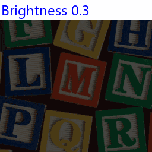

==========================
ImageEnhance Brightness
==========================

| See: https://pillow.readthedocs.io/en/stable/reference/ImageEnhance.html#PIL.ImageEnhance.Brightness

----

Brightness
----------------------

| Use the ``ImageEnhance.Brightness(image).enhance(factor)`` method to return an image with adjusted brightness.

.. py:function:: ImageEnhance.Brightness(image).enhance(factor)

    | **factor** is a floating point value controlling the enhancement. There are no restrictions on this value.
    | Factor 1.0 always returns a copy of the original image.
    | lower factors mean less brightness, and higher values more.

.. code-block:: python

    from PIL import Image, ImageEnhance

    with Image.open("test_images/alph_blocks.png") as im:
        new_im = ImageEnhance.Brightness(im).enhance(0.5)
        new_im.save("enhanced/brightness0_5.png")
        new_im = ImageEnhance.Brightness(im).enhance(0.8)
        new_im.save("enhanced/brightness0_8.png")
        new_im = ImageEnhance.Brightness(im).enhance(1)
        new_im.save("enhanced/brightness1.png")
        new_im = ImageEnhance.Brightness(im).enhance(1.3)
        new_im.save("enhanced/brightness1_3.png")
        new_im = ImageEnhance.Brightness(im).enhance(2)
        new_im.save("enhanced/brightness2.png")

| 
 

        
