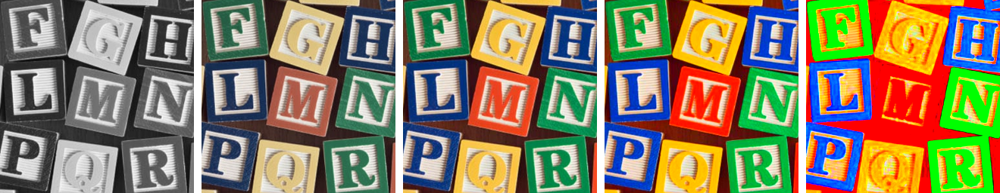
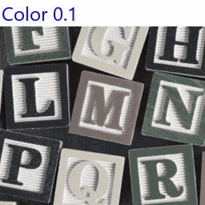

==========================
ImageEnhance Color
==========================

| See: https://pillow.readthedocs.io/en/stable/reference/ImageEnhance.html#PIL.ImageEnhance.Color

----

Color
----------------------

| Use the ``ImageEnhance.Color(image).enhance(factor)`` method to return an image with adjusted colour.

.. py:function:: ImageEnhance.Color(image).enhance(factor)

    | **factor** is a floating point value controlling the enhancement. There are no restrictions on this value.
    | Factor 1.0 always returns a copy of the original image.
    | lower factors mean less color, and higher values more.

| The code below creates several images of various color enhancement factors.

.. code-block:: python

    from PIL import Image, ImageEnhance

    with Image.open("test_images/alph_blocks.png") as im:
        new_im = ImageEnhance.Color(im).enhance(0)
        new_im.save("enhanced/color0.png")
        new_im = ImageEnhance.Color(im).enhance(0.5)
        new_im.save("enhanced/color0_5.png")
        new_im = ImageEnhance.Color(im).enhance(1)
        new_im.save("enhanced/color1.png")
        new_im = ImageEnhance.Color(im).enhance(2)
        new_im.save("enhanced/color1_3.png")
        new_im = ImageEnhance.Color(im).enhance(10)
        new_im.save("enhanced/color2.png")

|  

        
