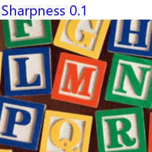

==========================
ImageEnhance Sharpness
==========================

| See: https://pillow.readthedocs.io/en/stable/reference/ImageEnhance.html#PIL.ImageEnhance.Sharpness

----

Sharpness
----------------------

| Use the ``ImageEnhance.Sharpness(image).enhance(factor)``method to adjust the sharpness of an image.

.. py:function:: ImageEnhance.Sharpness(image).enhance(factor)

    | return an enhanced image.
    | factor is a floating point value controlling the enhancement. There are no restrictions on this value.
    | Factor 1.0 always returns a copy of the original image.
    | lower factors mean less sharpness, and higher values more.

| The code below creates several images of various sharpness enhancement factors.

.. code-block:: python

    from PIL import Image, ImageEnhance

    with Image.open("test_images/alph_blocks.png") as im:
        new_im = ImageEnhance.Sharpness(im).enhance(0)
        new_im.save("enhanced/sharpness0.png")
        new_im = ImageEnhance.Sharpness(im).enhance(0.5)
        new_im.save("enhanced/sharpness0_5.png")
        new_im = ImageEnhance.Sharpness(im).enhance(1)
        new_im.save("enhanced/sharpness1.png")
        new_im = ImageEnhance.Sharpness(im).enhance(2)
        new_im.save("enhanced/sharpness2.png")
        new_im = ImageEnhance.Sharpness(im).enhance(10)
        new_im.save("enhanced/sharpness10.png")

.. image:: images/enhanced_sharpness.png
    :scale: 40%
    :align: center

|  

        
