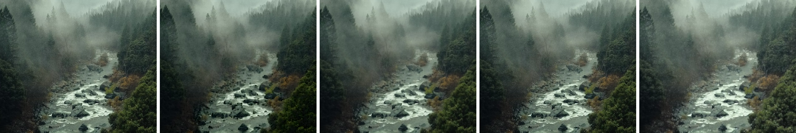

==========================
ImageFilter MedianFilter
==========================

| See: https://pillow.readthedocs.io/en/stable/reference/ImageFilter.html#PIL.ImageFilter.MedianFilter

----

MedianFilter
----------------------

| Use the ``Image.filter(ImageFilter.MedianFilter(radius=3))`` method to use the median pixel value in a pixel area given by the radius.

.. code-block:: python

    from PIL import Image, ImageFilter

   
    with Image.open("test_images/river_valley.jpg") as im:
        new_im = im.filter(ImageFilter.MedianFilter(size=3))
        new_im.save("filters/MedianFilter.png")

| Unfiltered, MinFilter, MedianFilter, ModeFilter and MaxFilter are compared below:

