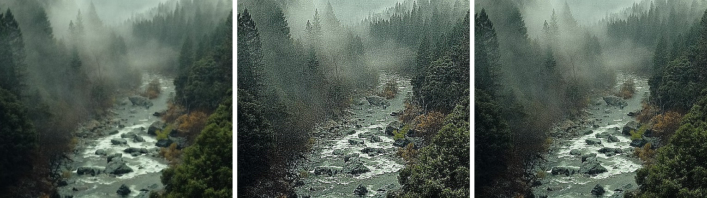
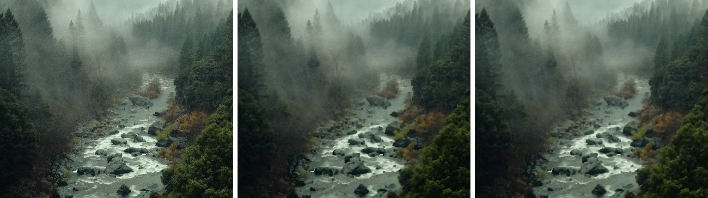

==========================
ImageFilter Introduction
==========================

| See: https://pillow.readthedocs.io/en/stable/reference/ImageFilter.html

----

Below is a list of predefined filters.

| BLUR

| 
| CONTOUR
.. image:: images/compare_contour.png
    :scale: 50%
    :align: center

| 
| DETAIL

| 
| EDGE_ENHANCE
| EDGE_ENHANCE_MORE

| 
| EMBOSS
.. image:: images/compare_emboss.png
    :scale: 50%
    :align: center

| 
| FIND_EDGES
.. image:: images/compare_find_edges.png
    :scale: 50%
    :align: center

| 
| SHARPEN
.. image:: images/compare_sharpen.png
    :scale: 50%
    :align: center

| 
| SMOOTH
| SMOOTH_MORE
.. image:: images/compare_smooth_more.png
    :scale: 50%
    :align: center

| 
| Below is a list of filters with parameters.

| BoxBlur

| 
| GaussianBlur

| 
| UnsharpMask
.. image:: images/compare_UnsharpMask.png
    :scale: 50%
    :align: center

| 
| Kernel

| 
| ModeFilter, MinFilter, MedianFilter, MaxFilter
.. image:: images/compare_Filters.png
    :scale: 25%
    :align: center

| 
| RankFilter

