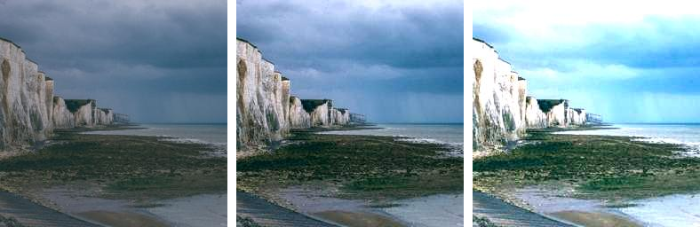

==========================
ImageOps autocontrast
==========================

| See: https://pillow.readthedocs.io/en/stable/reference/ImageOps.html#PIL.ImageOps.autocontrast

----

Autocontrast
---------------------------

| Use the ``ImageOps.autocontrast(image, cutoff=0, ignore=None, mask=None, preserve_tone=False)`` method to apply autocontrast an image.
| This function calculates a histogram of the input image (or mask region), removes cutoff percent of the lightest and darkest pixels from the histogram, and remaps the image so that the darkest pixel becomes black (0), and the lightest becomes white (255).

.. py:function:: ImageOps.autocontrast(image, cutoff=0, ignore=None, mask=None, preserve_tone=False)

    | **cutoff** - The percent to cut off from the histogram on the low and high ends. Either a tuple of (low, high), or a single number for both.
    | **ignore** - The background pixel value (use None for no background).
    | **mask** - Histogram used in contrast operation is computed using pixels within the mask. If no mask is given the entire image is used for histogram computation.
    | **preserve_tone** - Preserve image tone in Photoshop-like style autocontrast.

| The code below applies autocontrast to an image.

.. code-block:: python

    from PIL import Image, ImageOps

    with Image.open("test_images/cliffs.jpg") as im:
        im1 = ImageOps.autocontrast(im, cutoff=0, ignore=None, mask=None, preserve_tone=True) 
        im1.save("imageOps/autocontrast.jpg")
        im1 = ImageOps.autocontrast(im, cutoff=(0, 20), ignore=None, mask=None, preserve_tone=True) 
        im1.save("imageOps/autocontrast20.jpg")

