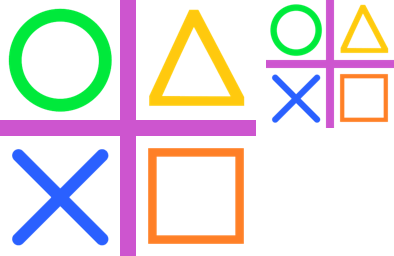

==========================
ImageOps contain
==========================

| See: https://pillow.readthedocs.io/en/stable/reference/ImageOps.html#PIL.ImageOps.contain

----

Contain
---------------------------

| Use the ``ImageOps.contain(image, size, method=Resampling.BICUBIC)`` method to return a resized version of the image, set to the maximum width and height within the requested size, while maintaining the original aspect ratio.
| The resultant image may not be the same size as requested, since the preservation of the aspect radio may lead to the extra length or width not being added.

| The image below is resized from 256, 256 to 128, 128. 
| Specifying 128, 256 caused it to be resized to fit the width. The extra height was ignored.

.. code-block:: python

    from PIL import Image, ImageOps

    with Image.open("test_images/shapes.png") as im:
        im1 = ImageOps.contain(im, size=(128, 256))
        im1.save("imageOps/contain.png")

