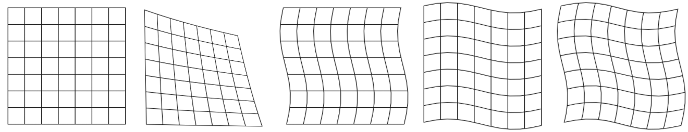
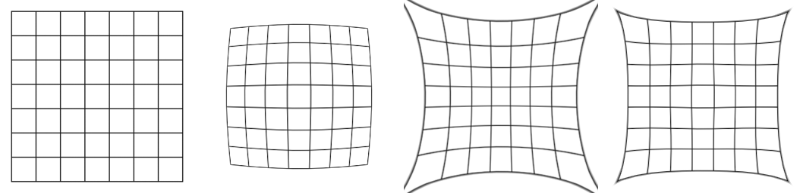

==========================
ImageOps deform
==========================

| See: https://pillow.readthedocs.io/en/stable/reference/ImageOps.html#PIL.ImageOps.deform
| See: https://www.pythoninformer.com/python-libraries/pillow/imageops-deforming/

----

Deform
---------------------------

| Use the ``ImageOps.deform(image, deformer, resample=Resampling.BILINEAR)`` method to deform an image.
| **deformer** is a deformer object that implements a getmesh method.
| Typical deformations include:
| Barrel (fisheye) distortion when an image appears more magnified at its centre than its edges.
| Pincushion distortion, which is the opposite of barrel distortion.
| Perspective distortion such as when a building will appear narrower at the top due to perspective.

getmesh
-----------------

| The deformation is controlled by a mesh whcih defines one or more rectangular regions on the target image which are aligned with the x and y axes of the image.
| For each target region, the mesh defines a quadrilateral region in the source image. The source region is deformed to fit the target rectangle.
| The deformer object is any object implement a getmesh function, which:
    * Accepts the image as a parameter.
    * Returns a list of mappings.

| An example of a single mapping is below:
| A mapping takes the form: ((0, 0, 256, 256), (0, 0, 0, 256, 256, 256, 256, 0))
| This mapping contains:
| The target rectangle, defined by the two points (0, 0) and (256, 256).
| The source quad, represented by the four points (0, 0), (0, 256), (256, 256), and (256, 0).
| Since the target is a rectangle, aligned to the axes, we can specify it using just two points, the top left and the bottom right. This completely defines the rectangle. 
| However, for the source quad, we need to specify all four corners:
| The top left (ie the corner that maps on to the top left of the target rectangle).
| The bottom left.
| The bottom right.
| The top right.

| The classes, in the code below, can be passed in as the deformer object.
| SingleDeformer uses a source rectangle that goes off the edge at the top right, while including the rest of the image.
| The WaveDeformer class has several parameters to control the use of sine wave transforms in the x and y direction.
| The BarrellDeformer class has several parameters to control the use of radial distortions.

.. code-block:: python

    from PIL import Image, ImageOps
    import math

    class SingleDeformer:

        def getmesh(self, img):
            #Map a target rectangle onto a source quad
            return [(
                    # target rectangle
                    (0, 0, 256, 256),
                    # corresponding source quadrilateral
                    (0, 0, 0, 256, 256, 256, 350, -100)
                    )]

    class WaveDeformer:

        def __init__(self, gridspace=20, sin_period_factor=40, x_dir=True, y_dir=True):
            self.gridspace = gridspace
            self.sin_amp = gridspace / 2
            self.sin_period_factor = sin_period_factor
            self.x_dir = x_dir
            self.y_dir = y_dir

        def transform_y(self, x, y):
            y = y + self.sin_amp * math.sin(x / self.sin_period_factor)
            return x, y

        def transform_x(self, x, y):
            x = x + self.sin_amp * math.sin(y / self.sin_period_factor)
            return x, y

        def transform_xy(self, x, y):
            x2 = x + self.sin_amp * math.sin(y / self.sin_period_factor)
            y2 = y + self.sin_amp * math.sin(x / self.sin_period_factor)
            return x2, y2

        def transform_rectangle(self, x0, y0, x1, y1):
            if self.x_dir and self.y_dir: 
                return (*self.transform_xy(x0, y0),
                        *self.transform_xy(x0, y1),
                        *self.transform_xy(x1, y1),
                        *self.transform_xy(x1, y0),
                        )
            elif self.x_dir: 
                return (*self.transform_x(x0, y0),
                        *self.transform_x(x0, y1),
                        *self.transform_x(x1, y1),
                        *self.transform_x(x1, y0),
                        )
            elif self.y_dir: 
                return (*self.transform_y(x0, y0),
                        *self.transform_y(x0, y1),
                        *self.transform_y(x1, y1),
                        *self.transform_y(x1, y0),
                        )
            else: 
                return (*self.transform_xy(x0, y0),
                        *self.transform_xy(x0, y1),
                        *self.transform_xy(x1, y1),
                        *self.transform_xy(x1, y0),
                        )

        def getmesh(self, img):
            self.w, self.h = img.size
            self.gridspace
            target_grid = []
            for x in range(0, self.w, self.gridspace):
                for y in range(0, self.h, self.gridspace):
                    target_grid.append((x, y, x + self.gridspace, y + self.gridspace))
            source_grid = [self.transform_rectangle(*rect) for rect in target_grid]
            return [t for t in zip(target_grid, source_grid)]

    class BarrellDeformer:
    
        def __init__(self, gridspace=10, k_1=0.2, k_2=0.05):
            self.gridspace = gridspace
            self.k_1 = k_1
            self.k_2 = k_2
            # adjust k_1 and k_2 to achieve the required distortion

        def getmesh(self, img):
            self.w, self.h = img.size
            self.gridspace
            target_grid = []
            for x in range(0, self.w, self.gridspace):
                for y in range(0, self.h, self.gridspace):
                    target_grid.append((x, y, x + self.gridspace, y + self.gridspace))
            source_grid = [self.transform_rectangle(*rect) for rect in target_grid]
            return [t for t in zip(target_grid, source_grid)]
            
    
        def transform(self, x, y):
            # center and scale the grid for radius calculation (distance from center of image)
            x_c = self.w/2 
            y_c = self.h/2 
            x = (x - x_c) / x_c
            y = (y - y_c) / y_c
            radius = math.sqrt(x**2 + y**2) # distance from the center of image
            m_r = 1 + self.k_1 * radius + self.k_2 * radius**2 # radial distortion model
            # apply the model 
            x = x * m_r 
            y = y * m_r
            # reverse the initial shifting
            x = x * x_c + x_c
            y = y * y_c + y_c
            return x, y

        def transform_rectangle(self, x0, y0, x1, y1): 
            return (*self.transform(x0, y0),
                    *self.transform(x0, y1),
                    *self.transform(x1, y1),
                    *self.transform(x1, y0),
                    )

    with Image.open("test_images/grid.png") as im:
        im1 = ImageOps.deform(im, SingleDeformer())
        im1.save("imageOps/deform.png")
        im1 = ImageOps.deform(im, WaveDeformer(gridspace=20, sin_period_factor=40, x_dir=True, y_dir=False))
        im1.save("imageOps/deform_wavex.png")
        im1 = ImageOps.deform(im, WaveDeformer(gridspace=20, sin_period_factor=40, x_dir=False, y_dir=True))
        im1.save("imageOps/deform_wavey.png")
        im1 = ImageOps.deform(im, WaveDeformer(gridspace=20, sin_period_factor=40, x_dir=True, y_dir=True))
        im1.save("imageOps/deform_wavexy.png")

    with Image.open("test_images/grid.png") as im:
        im1 = ImageOps.deform(im, BarrellDeformer(gridspace=20, k_1=0.2, k_2=0.05))
        im1.save("imageOps/deform_barrell.png")
        im1 = ImageOps.expand(im, border=40)
        im1 = ImageOps.deform(im1, BarrellDeformer(gridspace=20, k_1=-0.1, k_2=-0.1))
        im1 = ImageOps.fit(im1, size=(256, 256), centering=(0.5, 0.5))
        im1.save("imageOps/deform_pincushion.png")
        im1 = ImageOps.deform(im, BarrellDeformer(gridspace=20, k_1=+0.5, k_2=-0.4))
        im1.save("imageOps/deform_handlebar.png")

