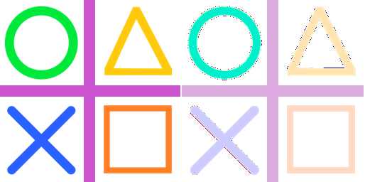

==========================
ImageOps equalize
==========================

| See: https://pillow.readthedocs.io/en/stable/reference/ImageOps.html#PIL.ImageOps.equalize

----

Equalize
---------------------------

| Use the ``ImageOps.equalize(image, mask=None)`` method to equalize the image histogram to return an image with a uniform distribution of grayscale values in the output image.
| **mask** - only the pixels selected by the mask are included in the analysis.
| Only L and RGB images can be used.

----

Equalize RGB
---------------------------

| The code below produces an RGB PNG with no transparency.

.. code-block:: python

    from PIL import Image, ImageOps

    with Image.open("test_images/cliffs.jpg") as im:
        im1 = ImageOps.equalize(im)
        im1.save("imageOps/equalize.png")

.. image:: images/compare_equalize.png
    :scale: 50%
    :align: center

----

Equalize RGBA
---------------------------

| The code below produces an RGBA PNG with transparency added back using black colours being transparent.

.. code-block:: python
    
    from PIL import Image, ImageOps

    with Image.open("test_images/shapes.png") as im:
        im1 = im.convert(mode='RGB')
        im1 = ImageOps.equalize(im1)
        im1.save("imageOps/equalize_rgb.png")

        im1 = im1.convert(mode='RGBA')

        datas = im1.getdata()
        newData = []
        for pixel in datas:
            if pixel[0] == 0 and pixel[1] == 0 and pixel[2] == 0: # finding black colour by its RGB value
                # storing a transparent value when we find a black colour
                newData.append((0, 0, 0, 0))
            else:
                newData.append(pixel) # other colours remain unchanged

        im1.putdata(newData)
        im1.save("imageOps/equalize_rgba.png")

