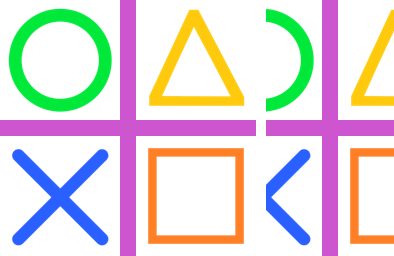
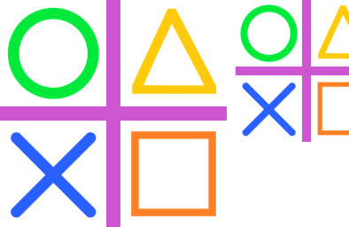

==========================
ImageOps fit
==========================

| See: https://pillow.readthedocs.io/en/stable/reference/ImageOps.html#PIL.ImageOps.fit

----

Fit
---------------------------

| Use the ``ImageOps.fit(image, size, method=Resampling.BICUBIC, bleed=0.0, centering=(0.5, 0.5))`` method to return an image that has been resized and cropped to the requested aspect ratio and size.

.. py:function:: ImageOps.fit(image, size, method=Resampling.BICUBIC, bleed=0.0, centering=(0.5, 0.5))

    | **bleed** - Remove a border around the outside of the image from all four edges. The value is a decimal percentage (use 0.01 for one percent). The default value is 0 (no border). Cannot be greater than or equal to 0.5.
    | **centering** - Control the cropping position. Use (0.5, 0.5) for center cropping (e.g. if cropping the width, take 50% off of the left side, and therefore 50% off the right side). 
    | **centering**=(0.0, 0.0) will crop from the top left corner (i.e. if cropping the width, take all of the crop off of the right side, and if cropping the height, take all of it off the bottom). 
    | **centering**=(1.0, 0.0) will crop from the bottom left corner, etc. (i.e. if cropping the width, take all of the crop off the left side, and if cropping the height take none from the top, and therefore all off the bottom).

| The image below fits vertically already, and is cropped horizontally to fit.

.. code-block:: python

    from PIL import Image, ImageOps

    with Image.open("test_images/shapes.png") as im:
        im1 = ImageOps.fit(im, size=(128, 256), centering=(0.5, 0.5))
        im1.save("imageOps/fit.png")

| The image below is scaled to fit the full height vertically, and is cropped horizontally, keeping the left side.

.. code-block:: python

    from PIL import Image, ImageOps

    with Image.open("test_images/shapes.png") as im:
        im1 = ImageOps.fit(im, size=(128, 160), centering=(0, 0))
        im1.save("imageOps/fit_128_160.png")

