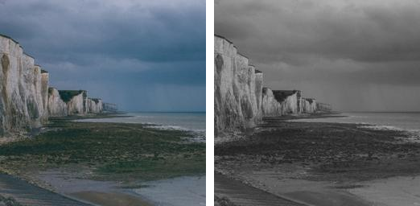

==========================
ImageOps grayscale
==========================

| See: https://pillow.readthedocs.io/en/stable/reference/ImageOps.html#PIL.ImageOps.grayscale

----

Grayscale
---------------------------

| Use the ``ImageOps.grayscale(image)`` method to convert an image to grayscale

.. code-block:: python

    from PIL import Image, ImageOps

    with Image.open("test_images/cliffs.jpg") as im:
        im1 = ImageOps.grayscale(im1)
        im1.save("imageOps/grayscale.png")

