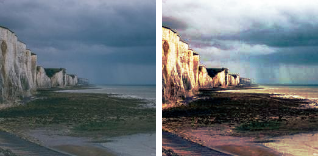
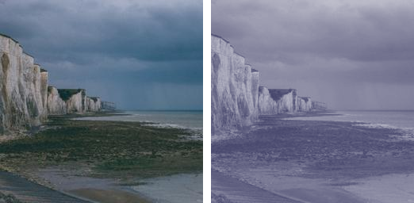

=============================
ImageOps Introduction: color
=============================

| See: https://pillow.readthedocs.io/en/stable/reference/ImageOps.html
| Below is a list of ImageOps methods related to color.

----

Image adjustment
---------------------------

| ImageOps.autocontrast
.. image:: images/compare_autocontrast.png
    :scale: 60%
    :align: center
    
| 
| ImageOps.equalize

----

Colour effects
---------------------

| ImageOps.grayscale
.. image:: images/compare_grayscale.png
    :scale: 60%
    :align: center

| ImageOps.colorize

| 
| ImageOps.invert
.. image:: images/compare_invert.png
    :scale: 60%
    :align: center

| 
| ImageOps.posterize
.. image:: images/compare_posterize.png
    :scale: 60%
    :align: center

| 
| ImageOps.solarize
.. image:: images/compare_solarize.png
    :scale: 60%
    :align: center

