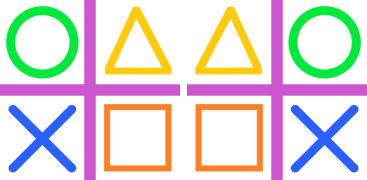
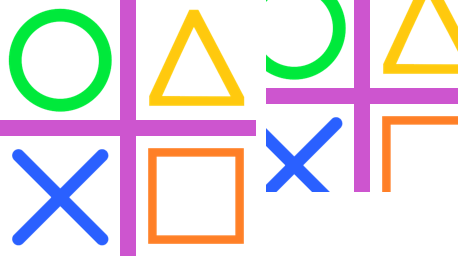

============================
ImageOps Introduction: size
============================

| See: https://pillow.readthedocs.io/en/stable/reference/ImageOps.html
| Below is a list of ImageOps methods related to size.

----

Image transformation functions
------------------------------------

| ImageOps.flip
.. image:: images/compare_flip.png
    :scale: 40%
    :align: center

| 
| ImageOps.mirror

----

Image resizing functions
-----------------------------

| ImageOps.pad
.. image:: images/compare_pad.png
    :scale: 40%
    :align: center
    
| 
| ImageOps.expand
.. image:: images/compare_expand.png
    :scale: 40%
    :align: center

| 
| ImageOps.crop

| 
| ImageOps.scale
.. image:: images/compare_scale.png
    :scale: 40%
    :align: center
| 
| ImageOps.fit
.. image:: images/compare_fit.png
    :scale: 40%
    :align: center

| 
| ImageOps.contain
.. image:: images/compare_contain.png
    :scale: 40%
    :align: center

| 
| ImageOps.deform
.. image:: images/compare_deform.png
    :scale: 40%
    :align: center

.. image:: images/compare_deform_distortions.png
    :scale: 40%
    :align: center

