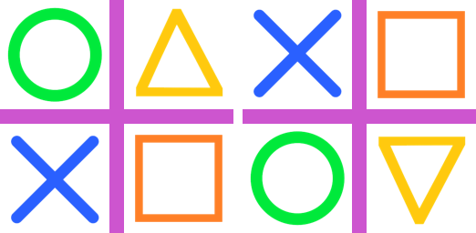
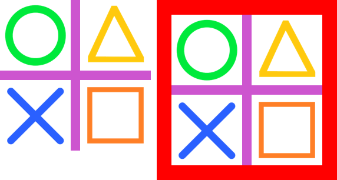
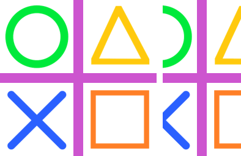
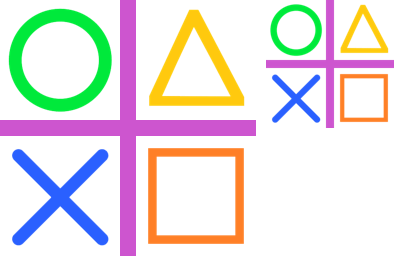
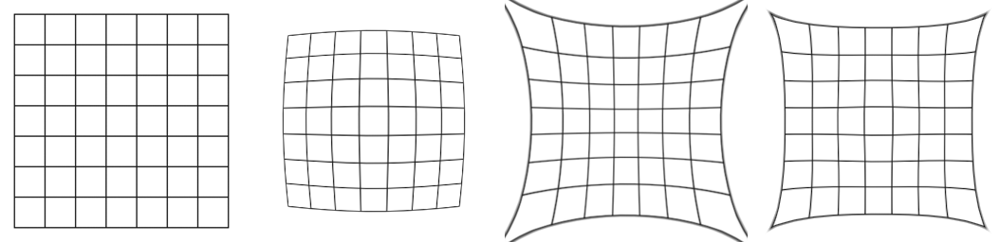

============================
ImageOps Introduction: size
============================

| See: https://pillow.readthedocs.io/en/stable/reference/ImageOps.html
| Below is a list of ImageOps methods related to size.

----

Image transformation functions
------------------------------------

| ImageOps.flip

| 
| ImageOps.mirror

----

Image resizing functions
-----------------------------

| ImageOps.pad
.. image:: images/compare_pad.png
    :scale: 40%
    :align: center
    
| 
| ImageOps.expand

| 
| ImageOps.crop

| 
| ImageOps.scale
.. image:: images/compare_scale.png
    :scale: 40%
    :align: center
| 
| ImageOps.fit

| 
| ImageOps.contain

| 
| ImageOps.deform
.. image:: images/compare_deform.png
    :scale: 40%
    :align: center

