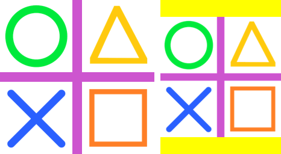

==========================
ImageOps pad
==========================

| See: https://pillow.readthedocs.io/en/stable/reference/ImageOps.html#PIL.ImageOps.pad

----

Pad
---------------------------

| Use the ``ImageOps.pad(image, size, method=Resampling.BICUBIC, color=None, centering=(0.5, 0.5))`` method to return an image that has been resized to fill the size, keep the aspect ratio, with padding added as needed.

.. py:function:: ImageOps.pad(image, size, method=Resampling.BICUBIC, color=None, centering=(0.5, 0.5))

    | image - The image to resize and crop.
    | size - The requested output size in pixels, given as a (width, height) tuple.
    | method - Resampling method to use. Default is PIL.Image.BICUBIC.
    | color - The background color of the padded image.
    | **centering**=(0.5, 0.5) will keep the image centered.
    | **centering**=(0, 0) will keep the image aligned to the top left.
    | **centering**=(1, 1) will keep the image aligned to the bottom right.

.. code-block:: python

    from PIL import Image, ImageOps

    with Image.open("test_images/shapes.png") as im:
        im1 = ImageOps.pad(im, size=(200, 256), color="yellow", centering=(0.5, 0.5))
        im1.save("imageOps/pad.png")

