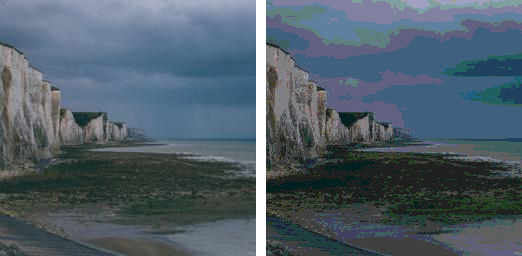

==========================
ImageOps posterize
==========================

| See: https://pillow.readthedocs.io/en/stable/reference/ImageOps.html#PIL.ImageOps.posterize

----

Posterize
---------------------------

| Use the ``ImageOps.posterize(image, bits)`` method to return an image with a reduced the number of bits for each color channel.
| **bits** - The number of bits to keep for each channel (1-8).

.. code-block:: python

    from PIL import Image, ImageOps

    with Image.open("test_images/cliffs.jpg") as im:
        im1 = ImageOps.posterize(im, 3)
        im1.save("imageOps/posterize.png")

