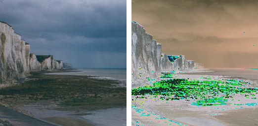

==========================
ImageOps solarize
==========================

| See: https://pillow.readthedocs.io/en/stable/reference/ImageOps.html#PIL.ImageOps.solarize

----

Solarize
---------------------------

| Use the ``ImageOps.solarize(image, threshold=128)`` method to return an image with all pixels above this greyscale level inverted.
| **threshold** - All pixels above this greyscale level are inverted.

.. code-block:: python

    from PIL import Image, ImageOps
    
    with Image.open("test_images/cliffs.jpg") as im:
        im1 = ImageOps.solarize(im, 50)
        im1.save("imageOps/solarize.png")

