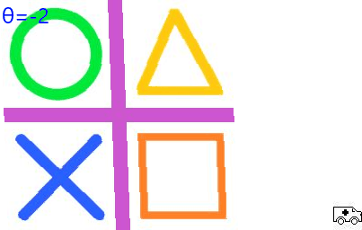

==========================
ImageSequence all_frames
==========================

| See: https://pillow.readthedocs.io/en/stable/reference/ImageSequence.html#PIL.ImageSequence.all_frames

----

All_frames
----------------------------

| Use the ``ImageSequence.all_frames(im, func=None)`` method to return a list of images from applying a given function to all frames in an image or a list of images. The frames are returned as a list of separate images.
| **im** - An image, or a list of images.
| **func** - The function to apply to all of the image frames.

----

All_frames
--------------------------

| The code below modifies all frames and saves them.

.. code-block:: python

    from PIL import Image, ImageSequence

    def addOverlay(frame):
        im = Image.open('images/ambulance_L.jpg')
        position = 'bottomRight'
        coords = {
            'topLeft': (0, 0),
            'bottomRight': (frame.width - im.width, frame.height - im.height)
        }
        frame.paste(im, coords[position])
        return frame

    with Image.open("gifs/transform_tilt_x.gif") as im_gif:
        # Run 'addOverlay' on each frame in the image
        frames = ImageSequence.all_frames(im_gif, addOverlay)
        # Save the frames as a new image
        frames[0].save('gifs/transform_tilt_x_overlay.gif', save_all=True, append_images=frames[1:])

