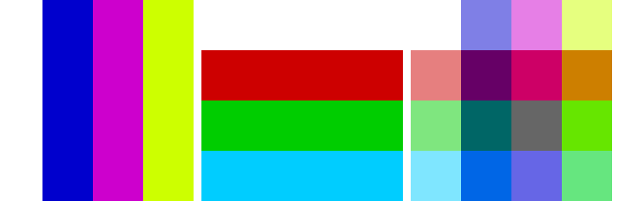

==========================
Image blend
==========================

| See: https://pillow.readthedocs.io/en/stable/reference/Image.html#PIL.Image.blend
| See: ImageChops.blend for the same results.

----

Blend
----------------------

| Use the ``Image.blend(image1, image2, alpha)`` method to return an image with a blend of two images using constant transparency weight.
| The second image, must have the same mode and size as the first image. 
| If alpha is 0.0, a copy of the first image is returned. If alpha is 1.0, a copy of the second image is returned. There are no restrictions on the alpha value. If necessary, the result is clipped to fit into the allowed output range.
| out = image1 * (1.0 - alpha) + image2 * alpha

.. code-block:: python

    from PIL import Image

    with Image.open("test_images/crosses.png") as im1:
        with Image.open("test_images/circles.png") as im2:
            blended = Image.blend(im1, im2, alpha=0.5)
            # blended.show()
            blended.save("Image/Image_blend.png")

