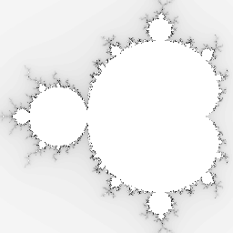
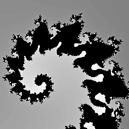

==========================
Image effect_mandelbrot
==========================

| See: https://pillow.readthedocs.io/en/stable/reference/Image.html#PIL.Image.effect_mandelbrot
| See: https://realpython.com/mandelbrot-set-python/

----

Effect_mandelbrot
----------------------------

| Use ``Image.effect_mandelbrot(size, extent, quality)`` to generate a Mandelbrot set covering the given extent (coordinates from the mandelbrot graph).
| size - the size of the image in pixels, as a 2-tuple: (width, height).
| extent - the mandelbrot coordinates for a bounding box as bottom-left and top-right corners, as a 4-tuple: (x0, y0, x1, y1).
| quality - the image quality on a scale from 0 to 100.

| The main mandelbrot belwo has been colour inverted so it looks better.

.. code-block:: python

    from PIL import Image

    new_im = Image.effect_mandelbrot((256, 256 ), (-1.5, -1, 0.5, 1), 100)
    new_im = ImageChops.invert(new_im)
    new_im.save("Image/Image_effect_mandelbrot.png")

| A small part of the mandelbrot set has been centered, showing a sprial below.

.. code-block:: python

    from PIL import Image

    new_im = Image.effect_mandelbrot((256, 256), (-0.7436, 0.1306, -0.7426, 0.1316), 100)
    new_im.save("Image/Image_effect_mandelbrot_spiral.png")

    