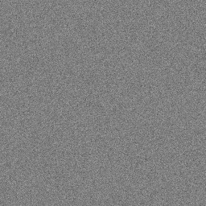

==========================
Image effect_noise
==========================

| See: https://pillow.readthedocs.io/en/stable/reference/Image.html#PIL.Image.effect_noise

----

Effect_noise
----------------------------

| Use ``Image.effect_noise(size, sigma)`` to generate Gaussian noise centered around 128.
| size - The requested size in pixels, as a 2-tuple: (width, height).
| sigma - Standard deviation of noise.

.. code-block:: python

    from PIL import Image

    new_im = Image.effect_noise((256, 256), 12)
    new_im.save("Image/Image_effect_noise.png")

    
